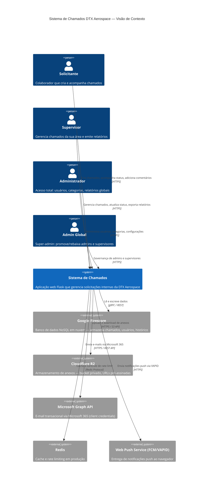
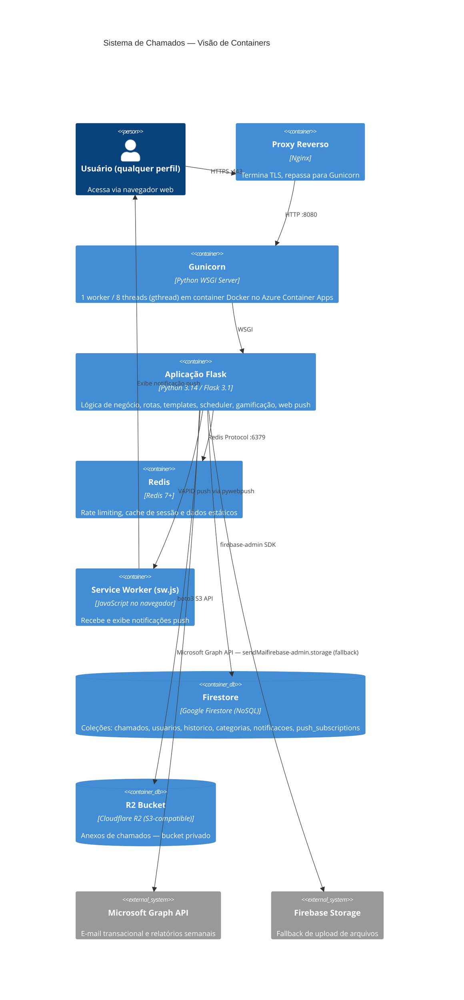
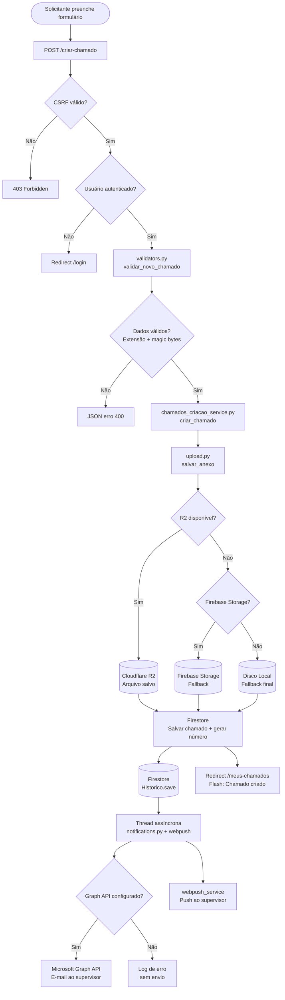
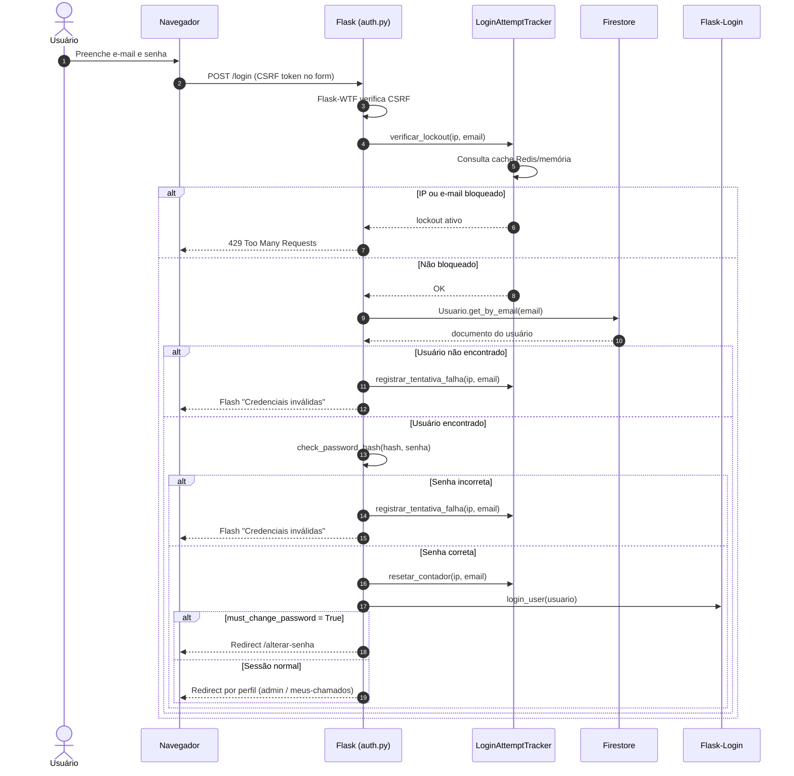
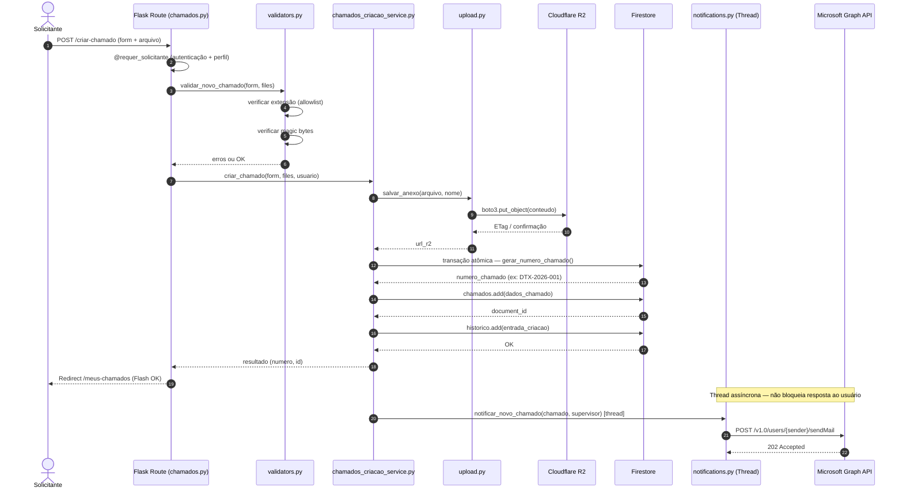
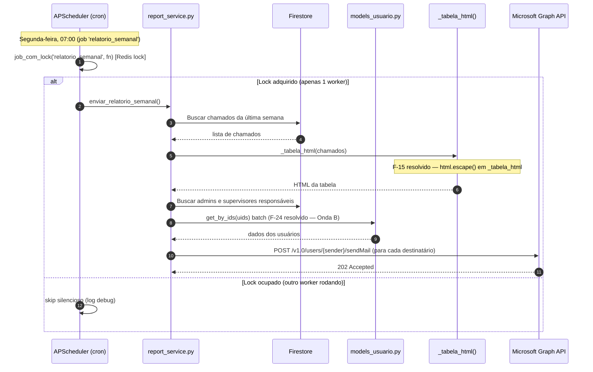
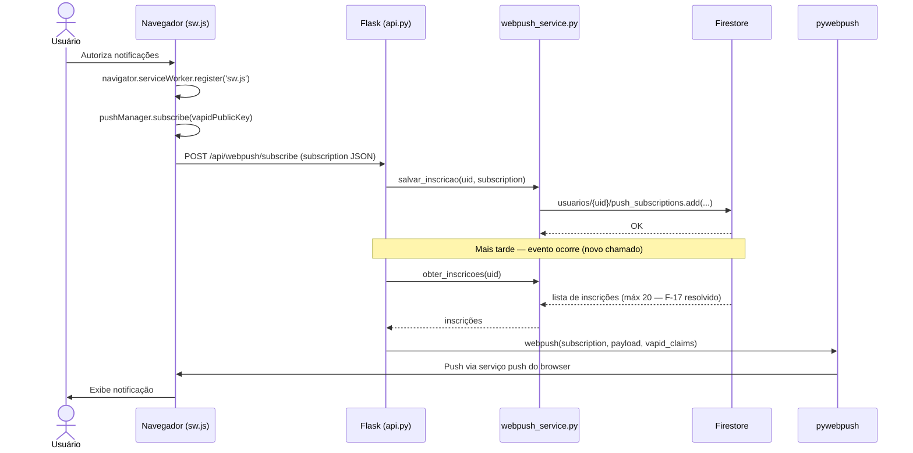
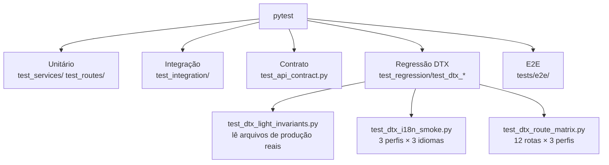

# Arquitetura do Sistema — Sistema de Chamados DTX Aerospace

| Campo | Valor |
|---|---|
| **Documento** | Arquitetura do Sistema |
| **Versão** | 2.3 |
| **Data** | 2026-06-18 |
| **Autor** | DTX Aerospace — Engenharia de Software |

---

## Índice

1. [Visão geral arquitetural](#1-visão-geral-arquitetural)
2. [Diagrama C4 — Context](#2-diagrama-c4--context)
3. [Diagrama C4 — Container](#3-diagrama-c4--container)
4. [Diagrama C4 — Component (Flask App)](#4-diagrama-c4--component-flask-app)
5. [Diagrama de fluxo de dados — Criação de chamado](#5-diagrama-de-fluxo-de-dados--criação-de-chamado)
6. [Diagrama de sequência — Autenticação](#6-diagrama-de-sequência--autenticação)
7. [Diagrama de sequência — Criação de chamado com upload](#7-diagrama-de-sequência--criação-de-chamado-com-upload)
8. [Diagrama de sequência — Relatório Semanal](#8-diagrama-de-sequência--relatório-semanal)
9. [Tabela completa de módulos](#9-tabela-completa-de-módulos)
10. [Sistema de Gamificação](#10-sistema-de-gamificação)
11. [Web Push e Service Worker](#11-web-push-e-service-worker)
12. [Decisões arquiteturais (ADR)](#12-decisões-arquiteturais-adr)
13. [Padrões de segurança implementados](#13-padrões-de-segurança-implementados)
14. [Limitações conhecidas](#14-limitações-conhecidas)
15. [Fluxo de deploy](#15-fluxo-de-deploy)
16. [Arquitetura de Testes](#16-arquitetura-de-testes)
17. [Design System DTX Light](#17-design-system-dtx-light)
18. [Índices Firestore](#18-índices-firestore)

---

## 1. Visão geral arquitetural

O Sistema de Chamados DTX Aerospace é uma aplicação web monolítica construída com Flask 3.1, organizada em camadas bem definidas: rotas (HTTP handler), serviços (lógica de negócio) e modelos (representação de dados). A persistência é feita integralmente no Google Firestore (banco NoSQL em nuvem), arquivos são armazenados no Cloudflare R2 com fallback em cascata para Firebase Storage e disco local. O sistema roda em container Docker no **Azure Container Apps** (imagem publicada no GHCR via CI/CD, ver seção 15), servido por Gunicorn (1 worker, 8 threads), e usa Redis para rate limiting e cache em produção. E-mails transacionais são enviados exclusivamente via Microsoft Graph API (client credentials). A internacionalização (PT-BR, EN, ES) combina `translations.json` (UI) com tradução automática de categorias via `translation_service.py` (mapa estático + MyMemory API). Gates de produção (pai + sub-etapas) são gerenciados em `categorias_gates` no Firestore, com catálogo canônico em `app/gates_config.py`. A interface é renderizada server-side com Jinja2, complementada por Tailwind CSS (compilado no Docker via Node.js 20) e animações GSAP. Jobs agendados (relatórios, alertas, reset de ranking semanal, limpeza de contadores_uso) são gerenciados pelo APScheduler embutido na aplicação, com **distributed lock Redis** (`scheduler_lock.py`) para evitar execução duplicada em multi-worker. A coleção `contadores_uso` tem política de retenção de **90 dias**: documentos mais antigos são removidos pelo job `limpar_contadores_uso` toda domingo às 02h00 BRT; o CLI `scripts/limpar_contadores_uso.py` permite execuções manuais em dry-run ou apply. O sistema inclui gamificação (EXP, níveis, conquistas), notificações push via Web Push API (VAPID + Service Worker) e o perfil `admin_global` para governança de administradores.

---

## 2. Diagrama C4 — Context



---

## 3. Diagrama C4 — Container



---

## 4. Diagrama C4 — Component (Flask App)

```mermaid
C4Component
    title Flask App — Componentes Internos

    Container_Boundary(flask, "Aplicação Flask") {
        Component(factory, "App Factory", "app/__init__.py", "Cria app, registra middlewares, APScheduler, warmup")

        Component(auth_routes, "Routes: Auth", "app/routes/auth.py", "Login, logout, troca de senha")
        Component(chamados_routes, "Routes: Chamados", "app/routes/chamados.py", "Criação e listagem de chamados")
        Component(dashboard_routes, "Routes: Dashboard", "app/routes/dashboard.py", "Painel supervisor/admin, export")
        Component(api_chamados_routes, "Routes: API Chamados", "app/routes/api_chamados.py", "Endpoints JSON: status, edição, bulk, paginação, onboarding")
        Component(api_colaboracao_routes, "Routes: API Colaboração", "app/routes/api_colaboracao.py", "Endpoints JSON: escalonamento, participantes")
        Component(api_notificacoes_routes, "Routes: API Notificações", "app/routes/api_notificacoes.py", "Endpoints JSON: notificações in-app, web push")
        Component(api_solicitante_routes, "Routes: API Solicitante", "app/routes/api_solicitante.py", "Endpoints JSON: self-service do solicitante")
        Component(usuarios_routes, "Routes: Usuários", "app/routes/usuarios.py", "CRUD usuários (admin)")
        Component(categorias_routes, "Routes: Categorias", "app/routes/categorias.py", "CRUD setores, gates, impactos + tradução automática")
        Component(admin_global_routes, "Routes: Admin Global", "app/routes/admin_global.py", "Governança de admins/supervisores (perfil admin_global)")

        Component(criacao_svc, "Service: Criação", "app/services/chamados_criacao_service.py", "Cria chamado: upload, numeração, histórico, notif")
        Component(status_svc, "Service: Status", "app/services/status_service.py", "Atualiza status, histórico, gamificação")
        Component(upload_svc, "Service: Upload", "app/services/upload.py", "R2 → Firebase Storage → disco")
        Component(notif_svc, "Service: Notificações", "app/services/notifications_core.py (+ notifications_chamados/_escalonamento/_usuarios.py; notifications.py é só barrel de reexport)", "E-mail via Microsoft Graph API")
        Component(webpush_svc, "Service: Web Push", "app/services/webpush_service.py + notifications_inapp.py", "Inscrições VAPID + envio push")
        Component(report_svc, "Service: Relatório", "app/services/report_service.py", "Relatório semanal HTML para e-mail")
        Component(analytics_svc, "Service: Analytics", "app/services/analytics.py", "Métricas, SLA, relatórios")
        Component(gamif_svc, "Service: Gamificação", "app/services/gamification_service.py", "EXP, níveis, conquistas, exp_semanal")
        Component(perm_svc, "Service: Permissões", "app/services/permissions.py", "RBAC por chamado")
        Component(login_svc, "Service: Login Attempts", "app/services/login_attempts.py", "Lockout, contador")
        Component(assign_svc, "Service: Atribuição", "app/services/assignment.py", "Round-robin, aleatório, manual")
        Component(gates_svc, "Service: Gates", "app/services/gates_service.py", "Sub-etapas do formulário e validação de gates")
        Component(gates_cfg, "Config: Gates", "app/gates_config.py", "Catálogo canônico estático de gates e sub-etapas")
        Component(contador_svc, "Service: Contadores", "app/services/contadores_uso.py", "Limite diário de uso")

        Component(i18n, "i18n", "app/i18n.py", "PT-BR/EN/ES com cache de mtime")
        Component(cache, "Cache", "app/cache.py", "Redis/memória com TTL")
        Component(decoradores, "Decoradores", "app/decoradores.py", "@requer_perfil, @requer_supervisor_area")
    }

    Rel(auth_routes, login_svc, "Verifica tentativas")
    Rel(chamados_routes, criacao_svc, "Delega criação")
    Rel(criacao_svc, upload_svc, "Upload de anexo")
    Rel(criacao_svc, notif_svc, "Notifica aprovador")
    Rel(criacao_svc, webpush_svc, "Push in-app")
    Rel(dashboard_routes, analytics_svc, "Métricas e relatórios")
    Rel(api_chamados_routes, status_svc, "Atualiza status")
    Rel(status_svc, gamif_svc, "Adiciona EXP")
    Rel(chamados_routes, gates_svc, "Sub-etapas do formulário")
    Rel(gates_svc, gates_cfg, "Fallback estático")
    Rel(factory, i18n, "Injeta t() em templates")
    Rel(factory, cache, "Inicializa conexão Redis")
    Rel(factory, report_svc, "APScheduler — relatório semanal")
```



---

## 5. Diagrama de fluxo de dados — Criação de chamado



---

## 6. Diagrama de sequência — Autenticação



---

## 7. Diagrama de sequência — Criação de chamado com upload



---

## 8. Diagrama de sequência — Relatório Semanal



---

## 9. Tabela completa de módulos

### Rotas e infraestrutura

| Módulo | Responsabilidade | Dependências principais | Perfis afetados |
|---|---|---|---|
| `app/__init__.py` | Factory Flask, middlewares, APScheduler, warmup de cache | config, limiter, i18n, routes | Todos |
| `app/routes/auth.py` | Login, logout, troca de senha obrigatória | LoginAttemptTracker, models_usuario | Todos |
| `app/routes/chamados.py` | Criação e listagem de chamados (solicitante) | chamados_criacao_service, validators | Todos |
| `app/routes/dashboard.py` | Dashboard, visualização, histórico, export | dashboard_service, status_service | supervisor, admin |
| `app/routes/api_chamados.py` | Endpoints JSON: status, edição, bulk, paginação, onboarding, health | permissions, status_service | Todos |
| `app/routes/api_colaboracao.py` | Endpoints JSON: escalonamento, participantes | permission_validation | supervisor, admin |
| `app/routes/api_notificacoes.py` | Endpoints JSON: notificações in-app, web push | notifications_inapp, webpush_service | Todos |
| `app/routes/api_solicitante.py` | Endpoints JSON: self-service do solicitante (download-anexo, editar, cancelar) | permissions | solicitante |
| `app/routes/usuarios.py` | CRUD de usuários | models_usuario, notifications | admin |
| `app/routes/categorias.py` | CRUD de setores, gates (pai + sub-etapa), impactos; tradução automática via `translation_service` | models_categorias, translation_service, gates_service | admin |
| `app/routes/admin_global.py` | Dashboard `/admin-global`; promover supervisor→admin e rebaixar admin→supervisor | models_usuario, decoradores | admin_global |

### Serviços de chamados

| Módulo | Responsabilidade | Dependências principais | Perfis afetados |
|---|---|---|---|
| `app/services/chamados_criacao_service.py` | Criação completa de chamado: upload, numeração, histórico, notificações | upload, assignment, GrupoRL | Todos |
| `app/services/chamados_listagem_service.py` | Queries e filtros de chamados com paginação cursor-based | database, permissions, pagination | Todos |
| `app/services/edicao_chamado_service.py` | Edição de chamado existente com histórico; max_len=3000 (mas descricao não trunca — F-25) | database, validators | supervisor, admin |
| `app/services/status_service.py` | Atualização de status, registro de histórico, gamificação | Historico, notifications, GamificationService | supervisor, admin |
| `app/services/dashboard_service.py` | Lógica do painel administrativo, filtros, agregações | chamados_listagem_service | supervisor, admin |
| `app/services/filters.py` | Filtragem em memória; chama `to_dict()` 5x por doc (F-23) | — | supervisor, admin |
| `app/services/pagination.py` | Utilitários de paginação Firestore cursor-based | database | Todos |

### Serviços de infraestrutura

| Módulo | Responsabilidade | Dependências principais | Notas |
|---|---|---|---|
| `app/services/upload.py` | Upload R2 → Firebase Storage → disco local (cadeia de fallback) | boto3, firebase_admin.storage | Cobertura 100% (S3-01) |
| `app/services/permissions.py` | RBAC: verifica quem pode ver/editar cada chamado | models_usuario | — |
| `app/services/analytics.py` | Métricas de SLA, relatório completo (max 2000 docs), KPIs | Firestore, cache | Cobertura 60% |
| `app/services/report_service.py` | Relatório semanal HTML para e-mail; `_tabela_html` com `html.escape()` (F-15 resolvido); N+1 em admins resolvido (F-24 — Onda B: batch `Usuario.get_by_ids`) | Firestore, Usuario, notif | — |
| `app/services/notifications_core.py` (+ `notifications_chamados/_escalonamento/_usuarios.py`; `notifications.py` é barrel de reexport) | E-mail transacional via Microsoft Graph API (client credentials) | email_templates, Graph API | Cobertura 98% (S3-02) |
| `app/services/notifications_inapp.py` | Notificações in-app via Web Push (VAPID) | pywebpush, webpush_service | — |
| `app/services/webpush_service.py` | Gerencia inscrições push: `MAX_INSCRICOES=20` com `.limit()` (F-17 resolvido 2026-06-18) | Firestore | — |
| `app/services/login_attempts.py` | Lockout de IP e e-mail, contador de tentativas | cache | — |
| `app/services/validators.py` | Validação de entrada: campos, extensões, magic bytes, gates (via `gates_service`) | gates_service, models_categorias | — |
| `app/services/excel_export_service.py` | Exportação de chamados e relatórios para .xlsx | openpyxl | supervisor, admin |
| `app/services/contadores_uso.py` | Limite diário de uso; transação atômica `@firestore.transactional` (F-13/F-29 resolvidos); `limpar_contadores_antigos(dias=90)` — retenção 90 dias, job APScheduler domingo 02h00 BRT, CLI `scripts/limpar_contadores_uso.py` (F-31 resolvido 2026-06-19) | Firestore, Increment | Todos |

### Serviços de domínio

| Módulo | Responsabilidade | Notas |
|---|---|---|
| `app/services/assignment.py` | Atribuição automática: round-robin com Redis INCR atômico + fallback em memória (F-21 resolvido 2026-06-18), aleatório via `random.choice` (F-20 resolvido), manual; `area` validada — retorna `sucesso=False` se vazia (F-18 resolvido) | `REDIS_URL` env var; sem Redis → contador por processo |
| `app/services/translation_service.py` | Tradução PT→EN/ES: mapa estático `TRANSLATION_MAP` → MyMemory API → texto original; `adicionar_traducao_customizada()` chamado por `categorias.py` | `TRANSLATION_MAP` protegido por `_translation_map_lock` (F-16 resolvido) |
| `app/services/gamification_service.py` | EXP, níveis, conquistas; `_adicionar_exp` com `Increment()` atômico (F-14 resolvido); `resetar_ranking_semanal()` agendado domingo 23h59 BRT (F-27 resolvido) | — |
| `app/services/gates_service.py` | `build_gate_subetapas()` e `is_gate_valido()` — Firestore (`CategoriaGate`) com fallback para `gates_config`; resultado cacheado 5 min via `get_static_cached("gates_validos_set")` (F-22 resolvido 2026-06-18) | Invalidado por `_invalidar_cache_gates()` em `categorias.py` |
| `app/services/metrics.py` | Coleta e agregação de métricas de uso e SLA | — |
| `app/services/onboarding_service.py` | Tour de boas-vindas: avancar_passo, concluir_onboarding | — |
| `app/services/email_templates.py` | Builders HTML reutilizáveis para e-mails (`build_email_shell`, `build_detail_table`) | Usado por `notifications.py` |
| `app/services/notify_retry.py` | `executar_com_retry()` com backoff exponencial para envio de e-mail | Usado em `usuarios.py` |
| `app/services/permission_validation.py` | `supervisor_pode_alterar_chamado()`, `verificar_permissao_mudanca_status()` | Usado em `api_chamados.py`, `api_colaboracao.py` |
| `app/services/ab_service.py` | A/B test determinístico por UID (`get_variante`) — experimento AB-001 no formulário de chamados | Usado em `chamados.py`, `formulario.html` |

### Sistema de Gates (produção)

Gates representam etapas do fluxo produtivo DTX. O modelo é hierárquico: **gate pai** (Gate 1–4 ou N/A) + **sub-etapa** (valor canônico gravado no chamado, ex.: `"Gate 1 - Desmontagem"`).

```
Formulário (chamados.py)
  └── gates_service.build_gate_subetapas()
        ├── Firestore: categorias_gates (CategoriaGate.get_all_ativos)
        └── Fallback: app/gates_config.py (GATE_SUBETAPAS estático)

Validação (validators.py)
  └── gates_service.is_gate_valido(valor)
```

| Camada | Arquivo | Papel |
|---|---|---|
| Catálogo estático | `app/gates_config.py` | 16 sub-etapas canônicas + helpers de validação |
| Persistência | `app/models_categorias.py` → `CategoriaGate` | CRUD admin em `categorias_gates` |
| Serviço | `app/services/gates_service.py` | Monta dict do formulário e valida valores |
| Admin | `app/routes/categorias.py` | CRUD de gates com tradução automática |
| Migração | `scripts/migrations/migrar_gates_subetapas.py` | Migração idempotente de dados legados |

### Modelos

| Módulo | Responsabilidade | Notas |
|---|---|---|
| `app/models.py` | Modelo Chamado | — |
| `app/models_usuario.py` | Classe Usuario (UserMixin); perfis: solicitante, supervisor, admin, **admin_global**; `is_admin_or_above`, `to_dict/from_dict` | — |
| `app/models_categorias.py` | `CategoriaSetor`, `CategoriaGate` (gate_pai, etapa, ordem), `CategoriaImpacto`; tradução automática ao salvar | `CategoriaImpacto.save()` com `@firebase_retry(max_retries=3)` — F-19 resolvido 2026-06-18 |
| `app/models_historico.py` | Histórico de alterações de status por chamado | — |
| `app/models_grupo_rl.py` | Modelo `GrupoRL` — coleção `grupos_rl` para chamados ligados por código RL | — |

### Utilitários e configuração

| Módulo | Responsabilidade | Notas |
|---|---|---|
| `app/i18n.py` | Internacionalização PT-BR/EN/ES com cache de mtime (`translations.json`) | — |
| `app/cache.py` | Cache Redis em produção, dicionário em memória local, TTL configurável | — |
| `app/decoradores.py` | `@requer_perfil`, `@requer_solicitante`, `@requer_supervisor_area`, `@requer_admin` | — |
| `app/database.py` | Instância Firestore (db) — singleton | — |
| `app/gates_config.py` | Catálogo canônico estático: `GATE_PAI_OPCOES`, `GATE_SUBETAPAS` (16 sub-etapas + N/A) | Fallback quando Firestore vazio |
| `app/limiter.py` | Instância compartilhada `Limiter` (Flask-Limiter + Redis) | — |
| `app/firebase_retry.py` | Decorator `@firebase_retry` com backoff exponencial | — |
| `app/services/scheduler_lock.py` | `executar_job_com_lock(app, nome, fn)` — Redis distributed lock para jobs APScheduler; fallback sem lock se Redis indisponível | — |
| `app/exceptions.py` | Exceções customizadas (`ChamadoError`, `ValidacaoChamadoError`, etc.) | — |
| `app/utils.py` | Utilitários: get_client_ip (F-01), paginação, sanitização | — |
| `app/utils_areas.py` | `setor_para_area()` — Firestore `config/setor_para_area` como fonte de verdade + cache TTL 5 min + fallback estático `SETOR_PARA_AREA`; `invalidar_cache_setor_area()` para invalidação manual (F-30 resolvido) | `app/cache.py`, `app/database.py` |
| `config.py` | Carrega variáveis de ambiente, configurações Flask | — |
| `run.py` | Entry point da aplicação Flask | — |

### Frontend

| Arquivo | Responsabilidade | Notas |
|---|---|---|
| `app/static/js/gsap-motion.js` | Animações GSAP (API global `window.DTXgsap`) | — |
| `app/static/js/onboarding.js` | Tour de onboarding; hover via `mouseenter`/`mouseleave` em `bindCardEvents()` (F-48 resolvido 2026-06-18) | — |
| `app/static/js/table-filters.js` | Filtros de tabela client-side; strings i18n via `DTX_MSGS` do servidor (F-37, F-38, F-44 resolvidos) | — |
| `app/static/js/dashboard_otimizacoes.js` | Status, cancelamento via modal `<dialog>`; `DTX_MSGS`/`DTX_URLS`/`DTX_STATUS_VALIDOS` via servidor (F-33, F-34, F-36, F-46 resolvidos); guard `getElementById('dtx-dashboard-fade-keyframes')` evita dedup de `<style>` (F-41 resolvido 2026-06-19) | — |
| `/sw.js` (servido dinamicamente por `app/routes/api_notificacoes.py`, não é arquivo estático) | Service Worker Web Push; erros logados com `console.error` (F-43 resolvido) | — |

### Scripts

| Script | Propósito |
|---|---|
| `scripts/seed/init_categorias.py` | Semente inicial de categorias e setores no Firestore |
| `scripts/migrations/atualizar_firebase.py` | **OBSOLETO/PERIGOSO** — superado por `migrar_setores_catalogo.py` |
| `scripts/verificar_dependencias.py` | pip audit + pytest; diagnóstico de ambiente |
| `scripts/migrations/atualizar_setores_from_print.py` | Migração — sem dry-run, usar com cuidado |
| `scripts/qa/gerar_email_visual_snapshots.py` | QA — gera snapshots HTML de e-mails |
| `scripts/testar_email_smtp.py` | **Legado** — diagnóstico SMTP (substituído por Graph API) |
| `scripts/migrations/migrar_setores_catalogo.py` | Migração completa de setores com dry-run — preferir este |
| `scripts/migrations/migrar_gates_subetapas.py` | Migração idempotente de sub-etapas de gates |
| `scripts/migrations/atualizar_traducoes_setores.py` | Sincroniza traduções de setores/gates no Firestore |
| `scripts/promover_admin_global.py` | Promove usuário existente ao perfil `admin_global` |
| `scripts/gerar_vapid_keys.py` | Gera par de chaves VAPID para Web Push |

> **Removidos em v2.1:** `app/routes/traducoes.py` e `app/templates/admin_traducoes.html` — a UI administrativa de traduções foi substituída por tradução automática no fluxo de `categorias.py` + `translation_service.py`.

---

## 10. Sistema de Gamificação

### Visão geral

O sistema de gamificação recompensa usuários por interações com o sistema. É gerenciado por `app/services/gamification_service.py` e integrado ao fluxo de status em `app/services/status_service.py`.

### Estrutura de dados (Firestore)

```
usuarios/{uid}:
  ├── exp_total: int           # EXP acumulada de todos os tempos
  ├── exp_semanal: int         # EXP da semana atual (⚠️ nunca zerado — F-27)
  ├── nivel: int               # Nível calculado a partir do exp_total
  ├── conquistas: list[str]    # IDs de conquistas desbloqueadas
  └── ultima_atividade: datetime
```

### Fluxo de pontuação

```
Ação do usuário (ex: chamado concluído)
  └── status_service.py: atualizar_status()
      └── GamificationService._adicionar_exp(uid, +25)
          └── ⚠️ F-14: lê exp_atual → soma → escreve (sem transação)
              →  Race condition em requisições simultâneas
          └── atualizar nível se necessário
          └── verificar conquistas desbloqueadas
```

### Integração com status_service

| Evento | Quem recebe | EXP |
|---|---|---|
| Chamado criado | Solicitante | +10 |
| Chamado aceito pelo supervisor | Supervisor | +5 |
| Chamado concluído | Supervisor | +25 |
| Confirmação de resolução | Solicitante | +15 |
| Cancelamento de chamado | Solicitante | -5 |

### Limitações conhecidas

- `exp_semanal` é zerado semanalmente via `GamificationService.resetar_ranking_semanal()` agendado no APScheduler (domingo 23h59 BRT) — F-27 resolvido 2026-06-18.
- `_adicionar_exp` usa read-then-write sem transação — race condition possível (F-14). Correção planejada: S2-02 (usar `Increment()` atômico).

---

## 11. Web Push e Service Worker

### Visão geral

O sistema suporta notificações push via Web Push API com chaves VAPID. O usuário precisa explicitamente autorizar notificações no navegador.

### Componentes

| Componente | Arquivo | Responsabilidade |
|---|---|---|
| Service Worker | `/sw.js` — servido dinamicamente por `app/routes/api_notificacoes.py` (`service_worker_js()`), não é um arquivo estático | Roda em segundo plano no browser; recebe e exibe push |
| Serviço de inscrições | `app/services/webpush_service.py` | CRUD de inscrições push no Firestore |
| Envio de push | `app/services/notifications_inapp.py` | Usa pywebpush para enviar notificações |
| Rota de inscrição | `app/routes/api_notificacoes.py` — `/api/push-vapid-public` (GET), `/api/push-subscribe` (POST) | Endpoints de inscrição push; **não há rota de unsubscribe implementada hoje** |

### Fluxo completo



### Variáveis de ambiente

| Variável | Propósito |
|---|---|
| `VAPID_PUBLIC_KEY` | Chave pública (injetada no frontend) |
| `VAPID_PRIVATE_KEY` | Chave privada (apenas no servidor) |
| `VAPID_CLAIM_EMAIL` | E-mail de contato para o serviço push |

### Limitações conhecidas

- `obter_inscricoes` limitada a `MAX_INSCRICOES=20` via `.limit()` com warning de log ao atingir o teto — F-17 resolvido 2026-06-18.
- `sw.js` tem catch silencioso no parse do payload — erros de formato são perdidos sem log (F-43).

---

## 12. Decisões arquiteturais (ADR)

### ADR-01 — Blueprint único `main`

**Decisão:** Todos os módulos de rota registram no mesmo Blueprint chamado `main`.

**Contexto:** A aplicação tem volumes de tráfego e complexidade de rota que não justificam o overhead de múltiplos blueprints com prefixos de URL distintos.

**Razão:** Um único Blueprint simplifica o registro de rotas, elimina a necessidade de múltiplos `url_prefix`, e facilita o uso de `url_for('main.nome_da_view')` de forma consistente em todos os templates. A separação de responsabilidades é feita por arquivo, não por Blueprint.

**Trade-offs:** Com escala muito grande de rotas, um único Blueprint pode dificultar a descoberta. Mitigação: organização clara por arquivo em `app/routes/`.

---

### ADR-02 — Imports inline nas rotas

**Decisão:** Imports de serviços e modelos dentro das funções de rota, não no topo do arquivo.

**Contexto:** Os testes usam `unittest.mock.patch()` para interceptar chamadas a serviços externos (Firestore, Graph API, etc.).

**Razão:** Quando um módulo é importado no topo de um arquivo de rota, Python armazena a referência ao objeto importado no namespace do módulo. Ao tentar fazer `patch('app.services.X.funcao')`, o patch funciona no namespace do serviço, mas a rota já tem a referência "capturada". Com imports inline (dentro da função), a referência é resolvida em tempo de execução, quando o mock já está ativo.

**Trade-offs:** Pequena penalidade de performance por import a cada requisição (mitigada pelo cache do `sys.modules`). Possível estranhamento para desenvolvedores vindos de outros projetos.

---

### ADR-03 — Firestore em vez de SQL

**Decisão:** Google Firestore como banco de dados principal.

**Contexto:** A aplicação é nova, o volume de dados é moderado (< 100k documentos), e a infra já usa Firebase para storage e potencialmente autenticação futura.

**Razão:** Firestore oferece escalabilidade automática, sem necessidade de gerenciar servidor de banco de dados, e integra nativamente com o ecossistema Firebase/GCP. O modelo de dados hierárquico (coleções/documentos) se adequa bem ao domínio (chamado → histórico → comentários).

**Trade-offs:** Queries complexas (JOINs, agregações) são mais verbosas. Sem transações ACID completas entre coleções diferentes. Custo por operação de leitura (mitigado por cache). Limit de 2000 documentos por query (mitigado por paginação e limite em `analytics.py`). Operações read-then-write requerem uso explícito de transações Firestore para segurança de concorrência (ver F-13, F-14).

---

### ADR-04 — Cloudflare R2 em vez de Firebase Storage diretamente

**Decisão:** Cloudflare R2 como destino principal de uploads, com Firebase Storage como fallback.

**Contexto:** Precisamos armazenar anexos de forma segura com acesso controlado por URL temporária.

**Razão:** R2 tem custo por operação de egress muito menor que Firebase Storage (R2 não cobra egress para a internet). URLs pré-assinadas com validade de 1 hora implementam o controle de acesso necessário sem expor o bucket publicamente. A API S3-compatível permite usar `boto3` que é bem testado e documentado.

**Trade-offs:** Mais uma dependência externa (Cloudflare). Necessidade de implementar cadeia de fallback (R2 → Firebase → disco). Credenciais adicionais a gerenciar.

---

### ADR-05 — APScheduler em vez de Celery/Bull

**Decisão:** APScheduler embutido na aplicação Flask para jobs agendados.

**Contexto:** Precisamos de tarefas periódicas: relatório semanal, alertas de SLA, reset de ranking.

**Razão:** Celery requer um broker (RabbitMQ/Redis) e workers separados, o que aumenta significativamente a complexidade operacional para uma aplicação de desenvolvimento solo. APScheduler roda dentro do processo Flask, sem infraestrutura adicional. Os jobs atuais não têm requisitos de alta disponibilidade que justifiquem Celery.

**Por que não Celery:** Celery implicaria: (1) manter um broker Redis/RabbitMQ configurado separadamente, (2) rodar workers Celery como processos separados em produção (mais complexidade = mais custo), (3) orquestração de deploy mais complexa. Para o volume atual de jobs (relatório semanal + alertas + reset ranking), o overhead é desnecessário.

**Por que não Bull/BullMQ:** Bull é uma biblioteca Node.js. A stack é Python/Flask; misturar runtimes não é justificável para o volume de jobs atual.

**Trade-offs e mitigações:**
- Com múltiplos workers Gunicorn, cada worker tem sua própria instância do APScheduler, podendo disparar jobs N vezes (ver F-02). **Resolvido 2026-06-18:** `app/services/scheduler_lock.py` — todos os jobs usam `executar_job_com_lock()` com Redis lock (timeout=300s, blocking_timeout=0).
- Se o processo Flask cair durante um job, o job pode não completar. Para os jobs atuais (idempotentes), isso é aceitável.
- Se o volume de jobs crescer significativamente (> 20 jobs únicos, alta frequência, jobs com retry), migrar para Celery deve ser reconsiderado.
- Em produção com `min-replicas=0` (Container Apps free tier), o processo Flask raramente fica de pé pelos 10 min contínuos que o job `sla_escalacao` precisa — ele nunca dispara na prática (ver F-83). **Resolvido 2026-07-22:** para esse job crítico, o disparo passou a ser via HTTP (`POST /internal/cron/sla-escalacao`, autenticado por `CRON_SECRET`) chamado por um workflow externo do GitHub Actions a cada 10 min, que acorda o container só pelo tempo do job. O APScheduler in-process continua registrado como fallback (o lock Redis evita dupla execução se ambos disparar juntos); os demais jobs (baixa frequência/baixo impacto) seguem só no APScheduler in-process.

---

### ADR-06 — Flask-Login + Firestore em vez de Firebase Authentication

**Decisão:** Autenticação gerenciada pelo Flask-Login com hashes de senha armazenados no Firestore (Werkzeug `generate_password_hash`).

**Contexto:** A documentação original planejava usar Firebase Authentication, mas a implementação adotou Flask-Login.

**Razão:** Firebase Authentication adicionaria uma dependência de serviço externo para cada verificação de identidade. Flask-Login com Werkzeug hash é bem testado, não tem latência de rede nas verificações de sessão, e mantém o controle de autenticação inteiramente dentro da aplicação.

**Trade-offs:** Sem suporte nativo a OAuth2/SSO (poderia ser adicionado via Flask-Dance se necessário). Reset de senha por e-mail requer implementação própria (já existente via Microsoft Graph API).

---

### ADR-07 — `firestore.rules` nega todo acesso direto

**Status:** Aceito

**Contexto:** O Firestore pode ser acessado tanto via SDK Admin (backend) quanto diretamente pelo cliente (Firebase JS SDK no browser).

**Decisão:** `firestore.rules` configura `allow read, write: if false` — todo acesso direto ao banco pelo cliente é negado.

**Motivo:** O único consumidor do Firestore é o backend Flask via Firebase Admin SDK. As regras de negócio, autenticação e autorização são implementadas no servidor. Acesso direto do cliente não é necessário e representaria risco de segurança.

**Trade-off:** Se no futuro for necessário suporte a mobile/cliente com acesso direto ao Firestore, as rules precisarão ser reescritas com regras granulares por coleção e usuário.

---

## 13. Padrões de segurança implementados

| Padrão | Implementação | Arquivo(s) |
|---|---|---|
| **CSRF Protection** | Flask-WTF com token por sessão em todos os formulários POST | `app/__init__.py`, templates |
| **Autenticação** | Flask-Login com sessão server-side + must_change_password | `app/routes/auth.py`, `models_usuario.py` |
| **Rate limiting** | flask-limiter com Redis em produção (fallback memória) | `app/__init__.py`, `app/routes/auth.py` |
| **Brute-force lockout** | LoginAttemptTracker: IP + email, contador incremental | `app/services/login_attempts.py` |
| **Validação de uploads** | Extensão em allowlist + verificação magic bytes | `app/services/validators.py`, `upload.py` |
| **IDOR prevention** | Verificação `chamado_pertence_ao_usuario` antes de qualquer acesso a documento | `app/services/permissions.py` |
| **Download seguro** | URLs pré-assinadas R2 com validade 1h + verificação de permissão | `app/routes/api_solicitante.py` |
| **RBAC** | Decoradores @requer_perfil verificam perfil + área + status ativo | `app/decoradores.py` |
| **Criptografia PII** | Criptografia opcional de campos sensíveis (ENCRYPT_PII_AT_REST) | `app/models_usuario.py`, config |
| **Headers de segurança** | Content-Security-Policy, X-Frame-Options, X-Content-Type-Options | `app/__init__.py` (after_request) |
| **Inatividade** | Logout automático após 15 minutos de inatividade | `app/routes/auth.py`, JS |
| **Secrets em variáveis** | Nenhuma credencial no código-fonte; todas via `.env` / variáveis de ambiente | `.gitignore`, `config.py` |
| **Paginação** | Todas as consultas ao Firestore usam `.limit()` e `.start_after()` | `app/services/chamados_listagem_service.py` |
| **Bulk action limit** | Máximo 50 IDs por operação em lote (bulk-status) | `app/routes/api_chamados.py` |
| **VAPID Web Push** | Chaves VAPID em variáveis de ambiente; inscrições em Firestore | `app/services/webpush_service.py`, `sw.js` |

---

## 14. Limitações conhecidas

> Esta seção documenta limitações arquiteturais conhecidas, suas causas, mitigações atuais e planos futuros. Cada limitação tem um achado de auditoria correspondente.

| Limitação | Causa | Achado | Mitigação atual | Plano futuro |
|---|---|---|---|---|
| APScheduler com múltiplos workers | Sem distributed lock | F-02 | **Resolvido 2026-06-18** — `scheduler_lock.py` com Redis lock (timeout=300s, blocking_timeout=0) | — |
| IP spoofing no lockout | `X-Forwarded-For` sem ProxyFix | F-01 | **Resolvido 2026-06-17** — ProxyFix + `get_client_ip()` usa `remote_addr` | — |
| Race condition em contadores de uso | read-then-write sem transação | F-13 | **Resolvido 2026-06-17** — `@firestore.transactional` | — |
| Race condition em gamificação | read-then-write sem transação | F-14 | **Resolvido 2026-06-17** — `Increment()` atômico | — |
| HTML injection em relatório semanal | `_tabela_html` sem escaping | F-15 | **Resolvido 2026-06-17** — `html.escape()` em todos os campos | — |
| TRANSLATION_MAP sem lock em multi-thread | Dict global mutável sem threading.Lock | F-16 | **Resolvido 2026-06-17** | `threading.RLock` (S2-04) |
| Round-robin não funciona em multi-worker | `contador_round_robin` em memória por processo | F-21 | **Resolvido 2026-06-18** — Redis INCR + fallback em memória (`_atribuir_round_robin`) | — |
| Estratégia "aleatório" sempre seleciona o 1º | Bug em `_selecionar_supervisor` | F-20 | **Resolvido 2026-06-18** — `random.choice(supervisores_com_carga)` (Onda A) | — |
| Gates sem cache | Full-scan Firestore a cada chamada | F-22 | **Resolvido 2026-06-18** — `get_static_cached("gates_validos_set", ttl=300)` (Onda B) | — |
| `cursor_prev` retorna parâmetro de entrada | Bug em `listar_meus_chamados` | F-26 | **Resolvido 2026-06-18** — `cursor_prev = docs[0].id if docs and cursor else None` (Onda A) | — |
| Web Push sem limite de inscrições | `obter_inscricoes` sem `.limit()` | F-17 | **Resolvido 2026-06-18** — `MAX_INSCRICOES=20` com `.limit()` e warning de log | — |
| `exp_semanal` nunca zerado | Job de reset não agendado | F-27 | **Resolvido 2026-06-18** — `GamificationService.resetar_ranking_semanal()` agendado domingo 23h59 BRT | — |
| Queries Firestore limitadas a 2000 docs | Custo e latência | — | Limite explícito em analytics.py | Paginação incremental se necessário |
| Cache por processo sem Redis em dev | Simplicidade de setup | — | Cache em memória por worker | Redis obrigatório em staging |
| tailwind.min.css commitado e re-gerado | Build dual | F-11 | **Resolvido 2026-06-18** — arquivo adicionado ao `.gitignore`; `DEV_SETUP.md` documenta `npm run build:css` obrigatório; Dockerfile regenera no build | — |
| APScheduler sem persistência | Jobs perdidos em restart | — | Restart rápido pelo container | Aceitar (jobs idempotentes) |
| Notificações em thread sem retry | Simplicidade | — | Log de erro + `notify_retry.py` com backoff | Fila Redis se taxa de falha crescer |
| APScheduler in-process não dispara com `min-replicas=0` | Scale-to-zero mata o processo antes do job crítico (`sla_escalacao`, a cada 10min) completar um ciclo ocioso | F-83 | **Resolvido 2026-07-22** — rota `POST /internal/cron/sla-escalacao` (auth `CRON_SECRET`) + workflow `cron-sla-escalacao.yml` (GitHub Actions, cron a cada 10 min) acordam o container só pelo tempo do job, reaproveitando `scheduler_lock.py` | Estender o mesmo mecanismo a `reset_ranking_semanal`/`limpar_contadores_uso` se scale-to-zero também afetá-los na prática |
| Colisão em `gerar_numero_chamado` | Leitura e escrita do contador em duas operações separadas | F-58 | **Resolvido 2026-06-18** — `test_gerar_numero_chamado_concorrencia_gera_numeros_unicos` (5 threads, mock serializado, assert uniqueness) | Transação atômica Firestore |
| Scripts destrutivos sem dry-run | `atualizar_firebase.py` e `atualizar_setores_from_print.py` | F-71/72 | **Resolvido 2026-06-17** — flags `--dry-run`/`--apply`; obsoleto documentado em `scripts/README.md` | — |
| Strings hardcoded em JS | Mensagens PT-BR no frontend | F-34, F-36–F-38, F-44, F-46 | **Resolvido 2026-06-17** — `DTX_MSGS`/`DTX_URLS`/`DTX_STATUS_VALIDOS` via servidor | — |
| Cobertura baixa em upload/notifications | Caminhos críticos sem testes | F-06, F-07 | **Resolvido 2026-06-18** — upload 100%, notifications 98% | — |

---

## 15. Fluxo de deploy

```mermaid
flowchart LR
    DEV([Dev: git push]) --> GH[GitHub Actions\ncd-build-image.yml]
    GH --> BUILD[docker buildx build\nStage 0: Node 20 — npm ci + build tailwind.min.css\nStage 1: Python 3.14 — pip install\nStage 2: runtime]
    BUILD --> PUSH[Push da imagem\nghcr.io/matheusth16/sistema-chamados-dtx]
    PUSH --> AZURE[az containerapp update\nAzure Container Apps]
    AZURE --> GUNIC[Gunicorn via start.sh\n1 worker / 8 threads — gthread]
    GUNIC --> WARM[App warmup\nFirestore ping + cache init]
    WARM --> SCHED[APScheduler\nstart() — jobs agendados]
    SCHED --> READY([Pronto para tráfego])
```

> **Nota:** `railway.toml`, `cloudbuild.yaml` e `.gcloudignore` foram removidos (2026-06). O deploy de produção hoje é **Azure Container Apps** (free tier, plano Consumption): o workflow `.github/workflows/cd-build-image.yml` builda a imagem Docker, publica no GHCR (repositório público) e roda `az containerapp update` a cada push em `main`. `docker-compose.yml` + `Dockerfile` continuam existindo, mas servem apenas para desenvolvimento local — não são o mecanismo de produção. Ver `docs/DEPLOYMENT_PLAN.md` para o passo a passo completo.

### Variáveis de ambiente obrigatórias em produção

| Variável | Propósito |
|---|---|
| `SECRET_KEY` | Chave de sessão Flask (≥ 32 chars) |
| `GOOGLE_CREDENTIALS_JSON` | JSON das credenciais do Firebase Service Account |
| `R2_ENDPOINT_URL` | URL do endpoint Cloudflare R2 |
| `R2_ACCESS_KEY_ID` | Credencial R2 |
| `R2_SECRET_ACCESS_KEY` | Credencial R2 |
| `R2_BUCKET_NAME` | Nome do bucket R2 |
| `GRAPH_TENANT_ID` | Tenant ID Azure AD para e-mail via Graph API |
| `GRAPH_CLIENT_ID` | Client ID do app registration Azure |
| `GRAPH_CLIENT_SECRET` | Client secret value Azure |
| `GRAPH_SENDER_EMAIL` | Caixa de envio (ex: dtxls.support@dtx.aero) |
| `REDIS_URL` | URL do Redis (rate limiting e cache) |
| `ENCRYPTION_KEY` | Chave de criptografia PII (se ENCRYPT_PII_AT_REST=true) |
| `VAPID_PUBLIC_KEY` | Chave pública VAPID para Web Push |
| `VAPID_PRIVATE_KEY` | Chave privada VAPID para Web Push |
| `VAPID_CLAIM_EMAIL` | E-mail de contato para VAPID |

Ver lista completa em `docs/ENV.md`.

### Rollback

1. Acionar re-deploy da versão anterior via painel do provedor ou `git revert` + push
2. Não há migrações de banco (Firestore é schemaless) — rollback é imediato

### Verificação pós-deploy

```bash
# Healthcheck endpoint
curl https://seu-dominio.com/health

# Verificar logs em tempo real (Docker)
docker logs -f <container>
```

---

## 16. Arquitetura de Testes

### Camadas de teste

| Suíte | Localização | Propósito | Markers pytest |
|---|---|---|---|
| Unitário | tests/test_services/, tests/test_routes/ | Isola serviço ou rota via mocks | `@smoke` |
| Integração | tests/test_integration/ | Fluxos multi-módulo sem rede | `@regression` |
| Contrato | tests/test_routes/test_api_contract.py | Garante contrato JSON da API | `@api` |
| Regressão DTX | tests/test_regression/test_dtx_* | Invariantes do design system, i18n, matriz de rotas | `@regression` |
| E2E | tests/e2e/ | Fluxos completos via cliente HTTP | `@e2e` |

### Padrão de isolamento

As rotas usam imports inline (`from app.services.X import func`). O mock deve ser feito no módulo onde o símbolo é *usado*, não onde é definido:

```python
# Correto
with patch("app.services.edicao_chamado_service.db") as mock_db: ...

# Errado (mock inerte — teste passa mesmo com bug)
with patch("app.routes.api_chamados.db") as mock_db: ...  # NAO FAZER
```

### Fixtures do conftest.py

- `app` — instância Flask de teste (CSRF desabilitado, banco mockado)
- `client` — cliente HTTP não autenticado
- `client_logado_solicitante/supervisor/admin` — sessões autenticadas por perfil

### Gate de cobertura (2026-06-22)

| Gate | Threshold | Ferramenta |
|---|---|---|
| Global | ≥ 85% | `pytest.ini` (`--cov-fail-under=85`) |
| Por módulo | ≥ 85% cada `app/**/*.py` | `scripts/check_coverage_per_module.py` |
| CI | Ambos | `.github/workflows/ci.yml` |

Estado atual: 1435 testes, 94,98% global, 52/52 módulos OK. Baseline Ondas 0–4 concluído (13/13 módulos críticos elevados). Ver `docs/CHECKLIST_SEGURANCA.md` v3.4 e `docs/plans/adr-database-testabilidade.md`.

```bash
pytest --cov=app --cov-report=json -q
python scripts/check_coverage_per_module.py --json-only
```

### Diagrama da hierarquia de testes



### Suíte DTX como diferencial

`test_dtx_light_invariants.py` lê os arquivos de produção reais (`tailwind.config.js`, `app/static/css/input.css`) e verifica que os tokens do design system estão definidos. Não usa mocks — valida o artefato de produção diretamente. Isso significa que alterações acidentais no design system são detectadas automaticamente.

---

## 17. Design System DTX Light

### Pipeline de build CSS

```
app/static/css/input.css  +  tailwind.config.js
         ↓  npm run build:css  (Node.js + Tailwind CLI)
app/static/css/tailwind.min.css   <- artefato de build (NÃO versionado — ver .gitignore)
```

`tailwind.min.css` é gerado — não editar diretamente. Edite sempre `input.css`.

### Tokens principais

| Categoria | Token | Valor default |
|---|---|---|
| Primária | `--color-dtx-600` | `#1e4a8c` (azul DTX) |
| Hover | `--color-dtx-700` | `#163a70` |
| Fundo | `--color-surface-base` | `#F9FAFB` |
| Card | `--color-surface-raised` | `#FFFFFF` |
| Borda | `--color-surface-border` | `#E5E7EB` |
| Status ativo | `--color-status-active-bg` | `#DBEAFE` |
| Status fechado | `--color-status-closed-bg` | `#D1FAE5` |

### Z-index nomeada

| Camada | Valor | Componente |
|---|---|---|
| nav | 200 | Navbar |
| dropdown | 210 | Menus dropdown |
| overlay | 220 | Overlays |
| onboarding-backdrop | 8999 | Backdrop do tour |
| onboarding-card | 9001 | Card de onboarding |

### Restrições

- Sem `dark:` (modo escuro não suportado)
- Sem emojis em templates
- Sombra máxima: `shadow-dtx`
- Focus ring: `outline: 2px solid var(--color-dtx-600)` (padrão único)

### Referência

Especificação completa: `docs/plans/2026-06-12-dtx-light-design-system.md`

---

## 18. Índices Firestore

`firestore.indexes.json` define 20 índices compostos necessários para as queries do dashboard e listagens.

### Grupos de índices

| Grupo | Quantidade | Queries atendidas |
|---|---|---|
| chamados (dashboard) | 8 | Filtros por status, área, responsável, data |
| chamados (solicitante) | 4 | Listagem dos próprios chamados |
| notificações | 3 | Notificações por usuário e lidas/não lidas |
| usuários | 2 | Listagem por área e perfil |
| histórico | 3 | Histórico de atualizações por chamado |

### Deploy dos índices

```bash
firebase deploy --only firestore:indexes
```

### Nota sobre o campo `responsavel` (F-82 — resolvido)

O filtro do dashboard por responsável usa o campo **`responsavel`** (nome), conforme `app/services/filters.py` (`FieldFilter("responsavel", "==", ...)`). Portanto os índices compostos definidos sobre `responsavel` em `firestore.indexes.json` estão **corretos**. O campo `responsavel_id` (UID) também existe no modelo, mas é usado para atribuição, agrupamento e notificações — não para esse filtro. Não há divergência.

---

*Documento atualizado em 2026-06-18 — DTX Aerospace, Engenharia de Software*
