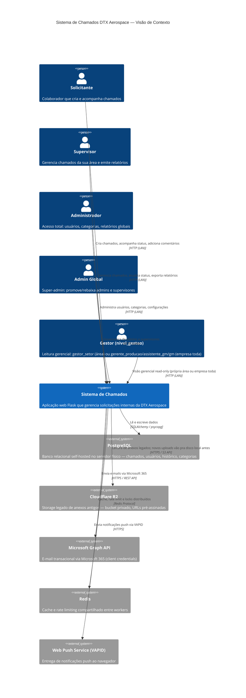
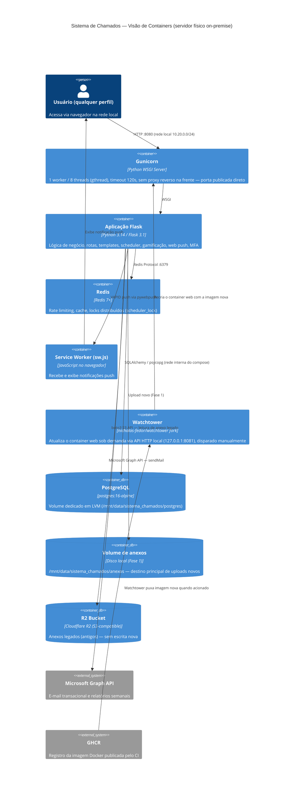
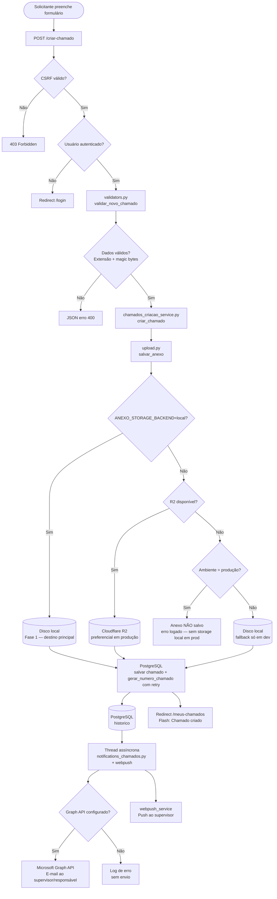
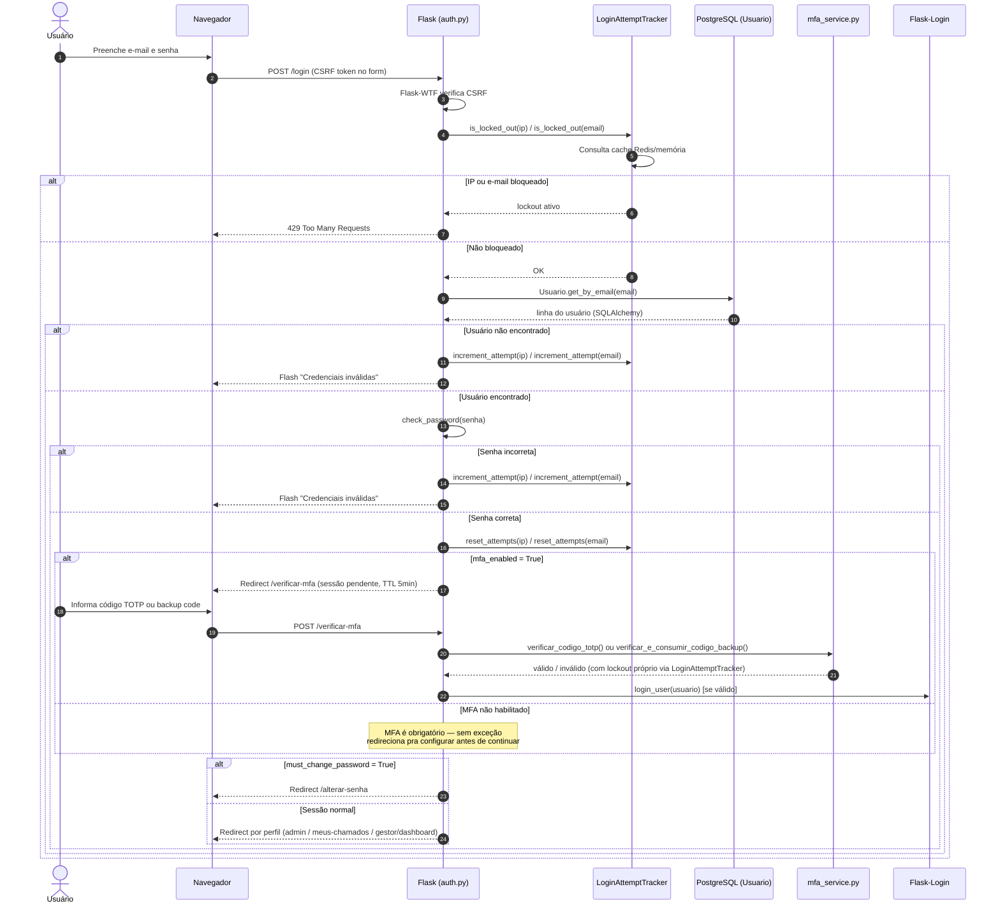
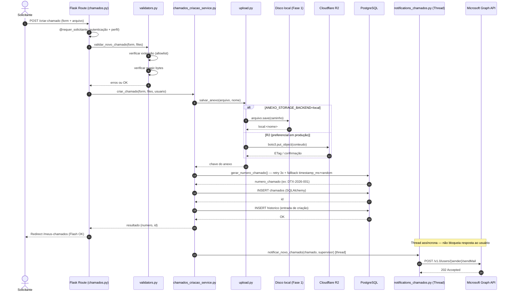
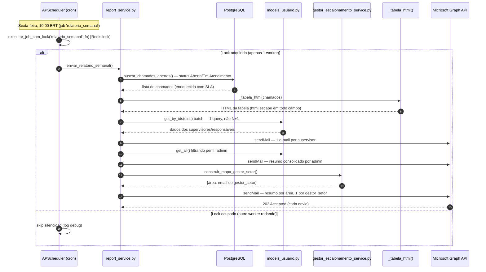
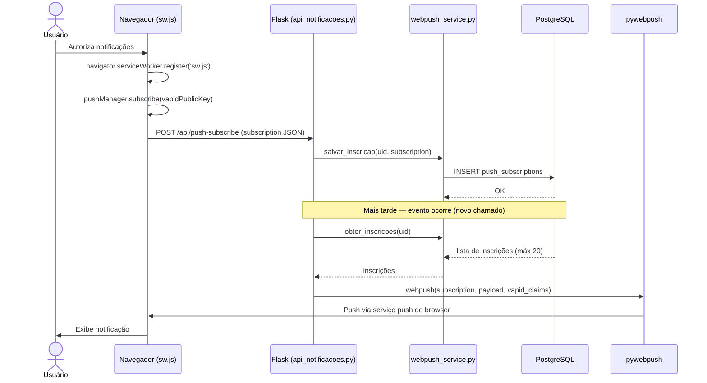
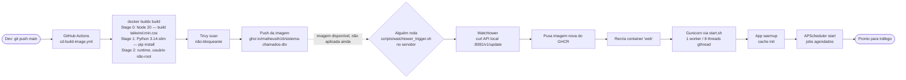
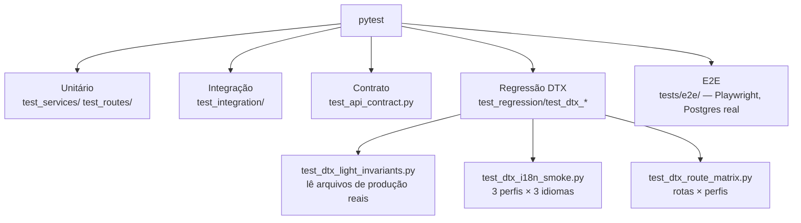

# Arquitetura do Sistema — Sistema de Chamados DTX Aerospace

| Campo | Valor |
|---|---|
| **Documento** | Arquitetura do Sistema |
| **Versão** | 3.0 |
| **Data** | 2026-08-06 |
| **Autor** | DTX Aerospace — Engenharia de Software |

> **Nota de versão 3.0**: reescrita completa pós-Marco 12. As versões 1.x–2.x descreviam uma
> arquitetura Firestore + Azure Container Apps que não existe mais em produção desde 2026-08-04
> (banco) e 2026-07-31 (hosting). Este documento reflete o estado real de hoje: PostgreSQL +
> servidor físico on-premise.

---

## Índice

1. [Visão geral arquitetural](#1-visão-geral-arquitetural)
2. [Diagrama C4 — Context](#2-diagrama-c4--context)
3. [Diagrama C4 — Container](#3-diagrama-c4--container)
4. [Diagrama C4 — Component (Flask App)](#4-diagrama-c4--component-flask-app)
5. [Diagrama de fluxo de dados — Criação de chamado](#5-diagrama-de-fluxo-de-dados--criação-de-chamado)
6. [Diagrama de sequência — Autenticação](#6-diagrama-de-sequência--autenticação)
7. [Diagrama de sequência — Criação de chamado com upload](#7-diagrama-de-sequência--criação-de-chamado-com-upload)
8. [Diagrama de sequência — Relatório Semanal](#8-diagrama-de-sequência--relatório-semanal)
9. [Tabela completa de módulos](#9-tabela-completa-de-módulos)
10. [Sistema de Gamificação](#10-sistema-de-gamificação)
11. [Web Push e Service Worker](#11-web-push-e-service-worker)
12. [Decisões arquiteturais (ADR)](#12-decisões-arquiteturais-adr)
13. [Padrões de segurança implementados](#13-padrões-de-segurança-implementados)
14. [Limitações conhecidas](#14-limitações-conhecidas)
15. [Fluxo de deploy](#15-fluxo-de-deploy)
16. [Arquitetura de Testes](#16-arquitetura-de-testes)
17. [Design System DTX Light](#17-design-system-dtx-light)
18. [Índices PostgreSQL](#18-índices-postgresql)

---

## 1. Visão geral arquitetural

O Sistema de Chamados DTX Aerospace é uma aplicação web monolítica construída com Flask 3.1,
organizada em camadas bem definidas: rotas (HTTP handler), serviços (lógica de negócio) e modelos
(representação de dados). A persistência é feita em **PostgreSQL** (SQLAlchemy 2.0 + Alembic para
migrações) — o Firestore, banco original do projeto, foi desligado em produção no Marco 12
(2026-08-04); `app/database.py` (inicializador Firestore) permanece no repositório só como rede de
segurança de rollback, sem nenhum import ativo em `app/`. Anexos novos vão para disco local
(volume dedicado no servidor, Fase 1), com Cloudflare R2 como fallback/storage legado (anexos
antigos ainda lidos de lá); o fallback intermediário via Firebase Storage foi removido por
completo. O sistema roda em container Docker no **servidor físico on-premise da DTX**
(10.20.0.199:8080, rede local, sem exposição à internet) — o Azure Container Apps, hosting
anterior, foi desativado em 2026-07-31. Servido por Gunicorn (**1 worker, 8 threads gthread**,
sem Nginx/proxy reverso na frente — a porta do container é publicada direto), usa Redis para rate
limiting e cache compartilhado entre processos (opcional com 1 worker; obrigatório se
`GUNICORN_WORKERS > 1`). E-mails transacionais são enviados exclusivamente via Microsoft Graph API
(client credentials). A internacionalização (PT-BR, EN, ES) combina `translations.json` (UI) com
tradução automática de categorias via `translation_service.py` (mapa estático + MyMemory API).
Gates de produção (pai + sub-etapas) são gerenciados via `CategoriaGate` (Postgres), com catálogo
canônico estático de fallback em `app/gates_config.py`. A interface é renderizada server-side com
Jinja2, complementada por Tailwind CSS (compilado no Docker via Node.js 20) e animações GSAP. Jobs
agendados (relatório semanal, escalonamento de SLA, alertas, reset de ranking, limpeza de
contadores) são gerenciados pelo APScheduler embutido na aplicação, com **distributed lock Redis**
(`scheduler_lock.py`) para evitar execução duplicada em multi-worker. O sistema inclui
gamificação (EXP, níveis, conquistas), notificações push via Web Push API (VAPID + Service
Worker), autenticação com **MFA obrigatório** (TOTP + códigos de backup) e SSO Microsoft (código
presente, mas hoje inerte — o fluxo OAuth exige redirect HTTPS, e o servidor roda em HTTP puro), o
perfil `admin_global` para governança de administradores, e um sistema de **escalonamento
gerencial de SLA** (Escada A/B, `nivel_gestao`: gestor_setor/gerente_producao/assistente_gm/gm) que
não existia nas versões anteriores deste documento.

---

## 2. Diagrama C4 — Context


```mermaid
C4Context
    title Sistema de Chamados DTX Aerospace — Visão de Contexto

    Person(solicitante, "Solicitante", "Colaborador que cria e acompanha chamados")
    Person(supervisor, "Supervisor", "Gerencia chamados da sua área e emite relatórios")
    Person(admin, "Administrador", "Acesso total: usuários, categorias, relatórios globais")
    Person(admin_global, "Admin Global", "Super-admin: promove/rebaixa admins e supervisores")
    Person(gestor, "Gestor (nivel_gestao)", "Leitura gerencial: gestor_setor (área) ou gerente_producao/assistente_gm/gm (empresa toda)")

    System(sistema, "Sistema de Chamados", "Aplicação web Flask que gerencia solicitações internas da DTX Aerospace")

    System_Ext(postgres, "PostgreSQL", "Banco relacional self-hosted no servidor físico — chamados, usuários, histórico, categorias")
    System_Ext(r2, "Cloudflare R2", "Storage legado de anexos antigos — bucket privado, URLs pré-assinadas")
    System_Ext(graph, "Microsoft Graph API", "E-mail transacional via Microsoft 365 (client credentials)")
    System_Ext(redis, "Redis", "Cache e rate limiting compartilhado entre workers")
    System_Ext(browser_push, "Web Push Service (VAPID)", "Entrega de notificações push ao navegador")

    Rel(solicitante, sistema, "Cria chamados, acompanha status, adiciona comentários", "HTTP (LAN)")
    Rel(supervisor, sistema, "Gerencia chamados, atualiza status, exporta relatórios", "HTTP (LAN)")
    Rel(admin, sistema, "Administra usuários, categorias, configurações", "HTTP (LAN)")
    Rel(admin_global, sistema, "Governança de admins e supervisores", "HTTP (LAN)")
    Rel(gestor, sistema, "Visão gerencial read-only (própria área ou empresa toda)", "HTTP (LAN)")

    Rel(sistema, postgres, "Lê e escreve dados", "SQLAlchemy / psycopg")
    Rel(sistema, r2, "Leitura de anexos legados; novos uploads vão pra disco local antes", "HTTPS / S3 API")
    Rel(sistema, graph, "Envia e-mails via Microsoft 365", "HTTPS / REST API")
    Rel(sistema, redis, "Cache, rate limit e locks distribuídos", "Redis Protocol")
    Rel(sistema, browser_push, "Envia notificações push via VAPID", "HTTPS")
```

---

## 3. Diagrama C4 — Container


```mermaid
C4Container
    title Sistema de Chamados — Visão de Containers (servidor físico on-premise)

    Person(usuario, "Usuário (qualquer perfil)", "Acessa via navegador na rede local")

    Container(gunicorn, "Gunicorn", "Python WSGI Server", "1 worker / 8 threads (gthread), timeout 120s, sem proxy reverso na frente — porta publicada direto")
    Container(flask_app, "Aplicação Flask", "Python 3.14 / Flask 3.1", "Lógica de negócio, rotas, templates, scheduler, gamificação, web push, MFA")
    Container(redis_cache, "Redis", "Redis 7+", "Rate limiting, cache, locks distribuídos (scheduler_lock)")
    Container(service_worker, "Service Worker (sw.js)", "JavaScript no navegador", "Recebe e exibe notificações push")
    Container(watchtower, "Watchtower", "nicholas-fedor/watchtower fork", "Atualiza o container web sob demanda via API HTTP local (127.0.0.1:8081), disparado manualmente")

    ContainerDb(postgres, "PostgreSQL", "postgres:16-alpine", "Volume dedicado em LVM (/mnt/data/sistema_chamados/postgres)")
    ContainerDb(disco_anexos, "Volume de anexos", "Disco local (Fase 1)", "/mnt/data/sistema_chamados/anexos — destino principal de uploads novos")
    ContainerDb(r2_bucket, "R2 Bucket", "Cloudflare R2 (S3-compatible)", "Anexos legados (antigos) — sem escrita nova")

    System_Ext(graph_ext, "Microsoft Graph API", "E-mail transacional e relatórios semanais")
    System_Ext(ghcr, "GHCR", "Registro da imagem Docker publicada pelo CI")

    Rel(usuario, gunicorn, "HTTP :8080 (rede local 10.20.0.0/24)")
    Rel(gunicorn, flask_app, "WSGI")
    Rel(flask_app, redis_cache, "Redis Protocol :6379")
    Rel(flask_app, postgres, "SQLAlchemy / psycopg (rede interna do compose)")
    Rel(flask_app, disco_anexos, "Upload novo (Fase 1)")
    Rel(flask_app, r2_bucket, "boto3 S3 API — leitura de anexo legado")
    Rel(flask_app, graph_ext, "Microsoft Graph API — sendMail")
    Rel(flask_app, service_worker, "VAPID push via pywebpush")
    Rel(service_worker, usuario, "Exibe notificação push")
    Rel(ghcr, watchtower, "Watchtower puxa imagem nova quando acionado")
    Rel(watchtower, gunicorn, "Recria o container web com a imagem nova")
```

---

## 4. Diagrama C4 — Component (Flask App)


```mermaid
C4Component
    title Flask App — Componentes Internos

    Container_Boundary(flask, "Aplicação Flask") {
        Component(factory, "App Factory", "app/__init__.py", "Cria app, registra middlewares, APScheduler, warmup, headers de segurança")

        Component(auth_routes, "Routes: Auth", "app/routes/auth.py", "Login, logout, troca de senha, verificação MFA, callback SSO")
        Component(mfa_routes, "Routes: MFA", "app/routes/mfa.py", "Configurar TOTP, códigos de backup, desativar (com rate limit)")
        Component(chamados_routes, "Routes: Chamados", "app/routes/chamados.py", "Criação e listagem de chamados")
        Component(dashboard_routes, "Routes: Dashboard", "app/routes/dashboard.py", "Painel supervisor/admin, export, flags de detalhe do chamado")
        Component(api_chamados_routes, "Routes: API Chamados", "app/routes/api_chamados.py", "Endpoints JSON: status, edição, bulk, paginação, onboarding")
        Component(api_infra_routes, "Routes: API Infra", "app/routes/api_infra.py", "/health (fail-closed), /internal/cron/sla-escalacao, /api/csp-report")
        Component(api_colaboracao_routes, "Routes: API Colaboração", "app/routes/api_colaboracao.py", "Endpoints JSON: escalonamento, participantes")
        Component(api_notificacoes_routes, "Routes: API Notificações", "app/routes/api_notificacoes.py", "Endpoints JSON: notificações in-app, web push, sw.js")
        Component(api_solicitante_routes, "Routes: API Solicitante", "app/routes/api_solicitante.py", "Endpoints JSON: self-service do solicitante")
        Component(usuarios_routes, "Routes: Usuários", "app/routes/usuarios.py", "CRUD usuários (admin)")
        Component(categorias_routes, "Routes: Categorias", "app/routes/categorias.py", "CRUD setores, gates, impactos + tradução automática")
        Component(admin_global_routes, "Routes: Admin Global", "app/routes/admin_global.py", "Governança de admins/supervisores (perfil admin_global)")

        Component(criacao_svc, "Service: Criação", "app/services/chamados_criacao_service.py", "Cria chamado: upload, numeração, histórico, notif")
        Component(status_svc, "Service: Status", "app/services/status_service.py", "Atualiza status, histórico, gamificação")
        Component(upload_svc, "Service: Upload", "app/services/upload.py", "local (Fase 1) → R2 → local (dev)")
        Component(notif_svc, "Service: Notificações", "notifications_core.py + _chamados/_escalonamento/_usuarios.py", "E-mail via Microsoft Graph API")
        Component(webpush_svc, "Service: Web Push", "webpush_service.py + notifications_inapp.py", "Inscrições VAPID + envio push")
        Component(report_svc, "Service: Relatório", "app/services/report_service.py", "Relatório semanal HTML — supervisor, admin, gestor de área")
        Component(analytics_svc, "Service: Analytics", "app/services/analytics.py", "Métricas, SLA, relatórios (lê config.Config pra prazos)")
        Component(sla_svc, "Service: Escalada SLA", "app/services/sla_escalacao_service.py", "Escada A/B — escalonamento gerencial a cada 10 min")
        Component(gestor_esc_svc, "Service: E-mails de Gestor", "app/services/gestor_escalonamento_service.py", "Fonte única de verdade pros e-mails de nivel_gestao")
        Component(gestor_dash_svc, "Service: Dashboard Gerencial", "app/services/gestor_dashboard_service.py", "Contexto read-only pra /gestor/dashboard")
        Component(gamif_svc, "Service: Gamificação", "app/services/gamification_service.py", "EXP, níveis, conquistas, exp_semanal")
        Component(perm_svc, "Service: Permissões (leitura)", "app/services/permissions.py", "RBAC — quem pode VER cada chamado")
        Component(perm_edicao_svc, "Service: Permissões (mutação)", "app/services/permissoes_edicao_chamado.py", "RBAC — quem pode EDITAR/mudar status")
        Component(mfa_svc, "Service: MFA", "app/services/mfa_service.py", "TOTP + códigos de backup de uso único")
        Component(sso_svc, "Service: SSO Microsoft", "app/services/sso_microsoft_service.py", "Entra ID (Auth Code + PKCE) — hoje inerte, exige HTTPS")
        Component(pii_svc, "Service: Criptografia PII", "app/services/pii_encryption.py", "Fernet, campos sensíveis em repouso (LGPD)")
        Component(login_attempt_svc, "Service: Login Attempts", "app/services/login_attempts.py", "Lockout de IP/e-mail, reusado pelo MFA self-service")
        Component(assign_svc, "Service: Atribuição", "app/services/assignment.py", "Round-robin, aleatório, manual")
        Component(gates_svc, "Service: Gates", "app/services/gates_service.py", "Sub-etapas do formulário e validação de gates")
        Component(gates_cfg, "Config: Gates", "app/gates_config.py", "Catálogo canônico estático de gates e sub-etapas")
        Component(contador_svc, "Service: Contadores", "app/services/contadores_uso.py", "Limite diário de uso, UPSERT atômico Postgres")
        Component(api_resp_svc, "Service: API Response", "app/services/api_response.py", "erro_json/sucesso_json — shape padrão das respostas /api/*")

        Component(i18n, "i18n", "app/i18n.py", "PT-BR/EN/ES com cache de mtime")
        Component(cache, "Cache", "app/cache.py", "Redis/memória com TTL")
        Component(decoradores, "Decoradores", "app/decoradores.py", "@requer_perfil, @requer_supervisor_area")
        Component(business_time, "Tempo Útil", "app/services/business_time.py", "Janela útil seg-sex 07:00-16:30 (almoço 11:30-13:00) — motor do SLA")
    }

    Rel(auth_routes, login_attempt_svc, "Verifica tentativas")
    Rel(auth_routes, mfa_svc, "Valida TOTP/backup code")
    Rel(auth_routes, sso_svc, "Fluxo OAuth Entra ID")
    Rel(mfa_routes, login_attempt_svc, "Rate limit na reconfirmação de senha")
    Rel(chamados_routes, criacao_svc, "Delega criação")
    Rel(criacao_svc, upload_svc, "Upload de anexo")
    Rel(criacao_svc, notif_svc, "Notifica aprovador")
    Rel(criacao_svc, webpush_svc, "Push in-app")
    Rel(dashboard_routes, analytics_svc, "Métricas e relatórios")
    Rel(dashboard_routes, perm_edicao_svc, "Flags de permissão da tela de detalhe")
    Rel(api_chamados_routes, status_svc, "Atualiza status")
    Rel(api_chamados_routes, api_resp_svc, "Formata resposta JSON")
    Rel(status_svc, gamif_svc, "Adiciona EXP")
    Rel(chamados_routes, gates_svc, "Sub-etapas do formulário")
    Rel(gates_svc, gates_cfg, "Fallback estático")
    Rel(factory, i18n, "Injeta t() em templates")
    Rel(factory, cache, "Inicializa conexão Redis")
    Rel(factory, report_svc, "APScheduler — relatório semanal (sex 10h BRT)")
    Rel(factory, sla_svc, "APScheduler — Escada A/B a cada 10 min")
    Rel(sla_svc, gestor_esc_svc, "Resolve e-mail do gestor por nível/área")
    Rel(report_svc, gestor_esc_svc, "Resolve gestor_setor por área")
    Rel(analytics_svc, business_time, "% de prazo decorrido (Escada B)")
```

---

## 5. Diagrama de fluxo de dados — Criação de chamado


```mermaid
flowchart TD
    A([Solicitante preenche formulário]) --> B[POST /criar-chamado]
    B --> C{CSRF válido?}
    C -- Não --> D[403 Forbidden]
    C -- Sim --> E{Usuário autenticado?}
    E -- Não --> F[Redirect /login]
    E -- Sim --> G[validators.py\nvalidar_novo_chamado]
    G --> H{Dados válidos?\nExtensão + magic bytes}
    H -- Não --> I[JSON erro 400]
    H -- Sim --> J[chamados_criacao_service.py\ncriar_chamado]
    J --> K[upload.py\nsalvar_anexo]
    K --> L{ANEXO_STORAGE_BACKEND=local?}
    L -- Sim --> M[(Disco local\nFase 1 — destino principal)]
    L -- Não --> N{R2 disponível?}
    N -- Sim --> O[(Cloudflare R2\npreferencial em produção)]
    N -- Não --> P{Ambiente = produção?}
    P -- Sim --> PERR[Anexo NÃO salvo\nerro logado — sem storage local em prod]
    P -- Não --> Q2[(Disco local\nfallback só em dev)]
    M --> Q[PostgreSQL\nsalvar chamado + gerar_numero_chamado com retry]
    O --> Q
    Q2 --> Q
    Q --> R[(PostgreSQL\nhistorico)]
    R --> S[Thread assíncrona\nnotifications_chamados.py + webpush]
    S --> T{Graph API configurado?}
    T -- Sim --> U[Microsoft Graph API\nE-mail ao supervisor/responsável]
    T -- Não --> V[Log de erro\nsem envio]
    S --> W[webpush_service\nPush ao supervisor]
    Q --> X[Redirect /meus-chamados\nFlash: Chamado criado]
```

---

## 6. Diagrama de sequência — Autenticação


```mermaid
sequenceDiagram
    autonumber
    actor U as Usuário
    participant B as Navegador
    participant F as Flask (auth.py)
    participant L as LoginAttemptTracker
    participant DB as PostgreSQL (Usuario)
    participant MFA as mfa_service.py
    participant FLG as Flask-Login

    U->>B: Preenche e-mail e senha
    B->>F: POST /login (CSRF token no form)
    F->>F: Flask-WTF verifica CSRF
    F->>L: is_locked_out(ip) / is_locked_out(email)
    L->>L: Consulta cache Redis/memória
    alt IP ou e-mail bloqueado
        L-->>F: lockout ativo
        F-->>B: 429 Too Many Requests
    else Não bloqueado
        L-->>F: OK
        F->>DB: Usuario.get_by_email(email)
        DB-->>F: linha do usuário (SQLAlchemy)
        alt Usuário não encontrado
            F->>L: increment_attempt(ip) / increment_attempt(email)
            F-->>B: Flash "Credenciais inválidas"
        else Usuário encontrado
            F->>F: check_password(senha)
            alt Senha incorreta
                F->>L: increment_attempt(ip) / increment_attempt(email)
                F-->>B: Flash "Credenciais inválidas"
            else Senha correta
                F->>L: reset_attempts(ip) / reset_attempts(email)
                alt mfa_enabled = True
                    F-->>B: Redirect /verificar-mfa (sessão pendente, TTL 5min)
                    U->>B: Informa código TOTP ou backup code
                    B->>F: POST /verificar-mfa
                    F->>MFA: verificar_codigo_totp() ou verificar_e_consumir_codigo_backup()
                    MFA-->>F: válido / inválido (com lockout próprio via LoginAttemptTracker)
                    F->>FLG: login_user(usuario) [se válido]
                else MFA não habilitado
                    Note over F: MFA é obrigatório — sem exceção<br/>redireciona pra configurar antes de continuar
                end
                alt must_change_password = True
                    F-->>B: Redirect /alterar-senha
                else Sessão normal
                    F-->>B: Redirect por perfil (admin / meus-chamados / gestor/dashboard)
                end
            end
        end
    end
```

---

## 7. Diagrama de sequência — Criação de chamado com upload


```mermaid
sequenceDiagram
    autonumber
    actor S as Solicitante
    participant R as Flask Route (chamados.py)
    participant V as validators.py
    participant C as chamados_criacao_service.py
    participant U as upload.py
    participant Disco as Disco local (Fase 1)
    participant R2 as Cloudflare R2
    participant DB as PostgreSQL
    participant N as notifications_chamados.py (Thread)
    participant G as Microsoft Graph API

    S->>R: POST /criar-chamado (form + arquivo)
    R->>R: @requer_solicitante (autenticação + perfil)
    R->>V: validar_novo_chamado(form, files)
    V->>V: verificar extensão (allowlist)
    V->>V: verificar magic bytes
    V-->>R: erros ou OK
    R->>C: criar_chamado(form, files, usuario)
    C->>U: salvar_anexo(arquivo, nome)
    alt ANEXO_STORAGE_BACKEND=local
        U->>Disco: arquivo.save(caminho)
        Disco-->>U: local:<nome>
    else R2 (preferencial em produção)
        U->>R2: boto3.put_object(conteudo)
        R2-->>U: ETag / confirmação
    end
    U-->>C: chave do anexo
    C->>DB: gerar_numero_chamado() — retry 3x + fallback timestamp_ms+random
    DB-->>C: numero_chamado (ex: DTX-2026-001)
    C->>DB: INSERT chamados (SQLAlchemy)
    DB-->>C: id
    C->>DB: INSERT historico (entrada de criação)
    DB-->>C: OK
    C-->>R: resultado (numero, id)
    R-->>S: Redirect /meus-chamados (Flash OK)
    Note over N,G: Thread assíncrona — não bloqueia resposta ao usuário
    C->>N: notificar_novo_chamado(chamado, supervisor) [thread]
    N->>G: POST /v1.0/users/{sender}/sendMail
    G-->>N: 202 Accepted
```

---

## 8. Diagrama de sequência — Relatório Semanal


```mermaid
sequenceDiagram
    autonumber
    participant APSched as APScheduler (cron)
    participant Report as report_service.py
    participant DB as PostgreSQL
    participant Usuario as models_usuario.py
    participant Gestor as gestor_escalonamento_service.py
    participant TabelaHTML as _tabela_html()
    participant Graph as Microsoft Graph API

    Note over APSched: Sexta-feira, 10:00 BRT (job 'relatorio_semanal')
    APSched->>APSched: executar_job_com_lock('relatorio_semanal', fn) [Redis lock]
    alt Lock adquirido (apenas 1 worker)
        APSched->>Report: enviar_relatorio_semanal()
        Report->>DB: buscar_chamados_abertos() — status Aberto/Em Atendimento
        DB-->>Report: lista de chamados (enriquecida com SLA)
        Report->>TabelaHTML: _tabela_html(chamados)
        TabelaHTML-->>Report: HTML da tabela (html.escape em todo campo)
        Report->>Usuario: get_by_ids(uids) batch — 1 query, não N+1
        Usuario-->>Report: dados dos supervisores/responsáveis
        Report->>Graph: sendMail — 1 e-mail por supervisor
        Report->>Usuario: get_all() filtrando perfil=admin
        Report->>Graph: sendMail — resumo consolidado por admin
        Report->>Gestor: construir_mapa_gestor_setor()
        Gestor-->>Report: {área: email do gestor_setor}
        Report->>Graph: sendMail — resumo por área, 1 por gestor_setor
        Graph-->>Report: 202 Accepted (cada envio)
    else Lock ocupado (outro worker rodando)
        APSched->>APSched: skip silencioso (log debug)
    end
```

---

## 9. Tabela completa de módulos

### Rotas e infraestrutura

| Módulo | Responsabilidade | Dependências principais | Perfis afetados |
|---|---|---|---|
| `app/__init__.py` | Factory Flask, middlewares, APScheduler, warmup, headers de segurança (CSP/HSTS) | config, limiter, i18n, routes | Todos |
| `app/routes/auth.py` | Login, logout, troca de senha, verificação MFA, callback SSO | LoginAttemptTracker, mfa_service, sso_microsoft_service | Todos |
| `app/routes/mfa.py` | Configurar TOTP + QR code, exibir/regenerar códigos de backup, desativar MFA (com rate limit) | mfa_service, login_attempts | Todos |
| `app/routes/chamados.py` | Criação e listagem de chamados (solicitante) | chamados_criacao_service, validators | Todos |
| `app/routes/dashboard.py` | Dashboard, visualização, histórico, export, flags de permissão de detalhe | dashboard_service, permissoes_edicao_chamado | supervisor, admin, gestor |
| `app/routes/api_chamados.py` | Endpoints JSON: status, edição, bulk, paginação, onboarding | permissoes_edicao_chamado, status_service, api_response | Todos |
| `app/routes/api_infra.py` | `/health` (fail-closed sem `HEALTH_SECRET`), `/internal/cron/sla-escalacao` (gatilho manual/backup), `/api/csp-report` | scheduler_lock | — |
| `app/routes/api_colaboracao.py` | Endpoints JSON: escalonamento, participantes | permissoes_edicao_chamado | supervisor, admin |
| `app/routes/api_notificacoes.py` | Endpoints JSON: notificações in-app, web push, serve `sw.js` dinamicamente | notifications_inapp, webpush_service | Todos |
| `app/routes/api_solicitante.py` | Endpoints JSON: self-service do solicitante (download-anexo, editar, cancelar) | permissions | solicitante |
| `app/routes/usuarios.py` | CRUD de usuários | models_usuario, notifications | admin |
| `app/routes/categorias.py` | CRUD de setores, gates (pai + sub-etapa), impactos; tradução automática via `translation_service` | models_categorias, translation_service, gates_service | admin |
| `app/routes/admin_global.py` | Dashboard `/admin-global`; promover supervisor→admin e rebaixar admin→supervisor | models_usuario, decoradores | admin_global |

### Serviços de chamados

| Módulo | Responsabilidade | Dependências principais | Perfis afetados |
|---|---|---|---|
| `app/services/chamados_criacao_service.py` | Criação completa de chamado: upload, numeração, histórico, notificações | upload, assignment, GrupoRL | Todos |
| `app/services/chamados_listagem_service.py` | Queries e filtros de chamados com paginação por cursor; `contar_status_por_solicitante` em 1 query `GROUP BY` | app.db (SQLAlchemy), permissions | Todos |
| `app/services/edicao_chamado_service.py` | Edição de chamado existente com histórico | app.db, validators | supervisor, admin |
| `app/services/status_service.py` | Atualização de status, registro de histórico, gamificação | Historico, notifications, GamificationService | supervisor, admin |
| `app/services/dashboard_service.py` | Lógica do painel administrativo, filtros, agregações | chamados_listagem_service | supervisor, admin |
| `app/services/escalonamento_service.py` | Ações manuais: transferir área, escalonar colega, incluir participantes/observadores, `editar_com_lock` (`SELECT ... FOR UPDATE`) | models.py, permissoes_edicao_chamado | supervisor, admin |
| `app/services/filters.py` | Filtragem em memória de chamados já carregados | — | supervisor, admin |

### Serviços de infraestrutura

| Módulo | Responsabilidade | Dependências principais | Notas |
|---|---|---|---|
| `app/services/upload.py` | Cascata: local (Fase 1) → R2 (preferencial em produção) → local (só dev) | boto3 | 100% cobertura |
| `app/services/permissions.py` | RBAC de VISIBILIDADE: quem pode VER cada chamado | models_usuario | Ver referência cruzada com permissoes_edicao_chamado.py |
| `app/services/permissoes_edicao_chamado.py` | RBAC de MUTAÇÃO: quem pode EDITAR/mudar status; `montar_flags_detalhe_chamado()` pra tela de detalhe | models_usuario, solicitante_edicao_service | Renomeado de `permission_validation.py` em 2026-08-06 |
| `app/services/analytics.py` | Métricas de SLA, relatório completo (max 2000 linhas), KPIs; lê prazos de `config.Config` em tempo de chamada (não hardcoded) | PostgreSQL, cache | — |
| `app/services/report_service.py` | Relatório semanal HTML — supervisor/responsável, admin (consolidado) e gestor_setor (por área) | PostgreSQL, Usuario, gestor_escalonamento_service | — |
| `app/services/notifications_core.py` (+ `notifications_chamados/_escalonamento/_usuarios.py`; `notifications.py` é barrel de reexport) | E-mail transacional via Microsoft Graph API (client credentials) | email_templates, Graph API | — |
| `app/services/notifications_inapp.py` | Notificações in-app via Web Push (VAPID) | pywebpush, webpush_service | — |
| `app/services/webpush_service.py` | Gerencia inscrições push: `MAX_INSCRICOES=20` | PostgreSQL | — |
| `app/services/login_attempts.py` | Lockout de IP e e-mail, contador de tentativas — reusado por `/login`, `/verificar-mfa` e `/mfa/desativar` | cache | Identificadores: IP, e-mail, `mfa:{uid}`, `mfa-selfservice:{uid}` |
| `app/services/validators.py` | Validação de entrada: campos, extensões, magic bytes, gates (via `gates_service`) | gates_service, models_categorias | — |
| `app/services/excel_export_service.py` | Exportação de chamados e relatórios para .xlsx | openpyxl | — |
| `app/services/contadores_uso.py` | Limite diário de uso; UPSERT atômico Postgres; `limpar_contadores_antigos(dias=90)` — retenção 90 dias, job APScheduler domingo 02h00 BRT | PostgreSQL | Todos |
| `app/services/api_response.py` | `erro_json`/`sucesso_json` — shape padrão `{"sucesso": bool, "erro"?: str, "dados"?: obj}` das respostas `/api/*` | — | Novo 2026-08-05, elimina duplicação em ~95 pontos |
| `app/services/notify_retry.py` | `executar_com_retry()` com backoff exponencial pras threads fire-and-forget de notificação | — | — |
| `app/services/email_templates.py` | Builders HTML reutilizáveis pra e-mail (`build_email_shell`, `build_detail_table`) | Usado por `notifications_core.py` | — |

### Serviços de SLA e escalonamento gerencial

| Módulo | Responsabilidade | Notas |
|---|---|---|
| `app/services/sla_escalacao_service.py` | Escada A (chamado Aberto sem resposta, thresholds `[1,2,3,4]h` úteis) + Escada B (chamado Em Atendimento passou do deadline, `[0,4,8,12]h` úteis / AOG `[0,30,60,120]min` corridos) + avisos 50%/80%. Roda via `processar_escada_a()`/`processar_avisos_resolucao()`/`processar_escada_b()`, chamado pelo APScheduler a cada 10 min | Ver `docs/adr/004-escalonamento-sla-gerencial.md` |
| `app/services/gestor_escalonamento_service.py` | Fonte única de verdade pros e-mails de escalonamento gerencial (`nivel_gestao`) — usado por `sla_escalacao_service.py` e pelo broadcast AOG imediato. Gestor de cada nível é sempre usuário real cadastrado, nunca e-mail fixo em env var | `NIVEL_PARA_CHAVE_GESTOR`: 1→gestor_setor, 2→gerente_producao, 3→assistente_gm, 4→gm |
| `app/services/gestor_dashboard_service.py` | Contexto read-only pra `/gestor/dashboard`: contadores e listas classificadas (atrasados, aberto_sem_resposta, multi_setor_travado, **em_dia** — 4ª raia, achado 2026-08-05) | Fase 5 |
| `app/services/business_time.py` | Motor de tempo útil: seg-sex, 07:00-11:30 e 13:00-16:30 BRT (almoço excluído), fins de semana excluídos | Base de cálculo do SLA não-AOG |

### Serviços de domínio

| Módulo | Responsabilidade | Notas |
|---|---|---|
| `app/services/assignment.py` | Atribuição automática: round-robin (Redis INCR + fallback em memória), aleatório, manual | `REDIS_URL` opcional; sem Redis → contador por processo |
| `app/services/translation_service.py` | Tradução PT→EN/ES: mapa estático `TRANSLATION_MAP` → MyMemory API → texto original | `_translation_map_lock` protege concorrência |
| `app/services/gamification_service.py` | EXP, níveis, conquistas; `resetar_ranking_semanal()` agendado domingo 23h59 BRT | — |
| `app/services/gates_service.py` | `build_gate_subetapas()` e `is_gate_valido()` — Postgres (`CategoriaGate`) com fallback pra `gates_config`; cache 5 min | Invalidado por `_invalidar_cache_gates()` em `categorias.py` |
| `app/services/metrics.py` | Coleta e agregação de métricas de uso e SLA | — |
| `app/services/onboarding_service.py` | Tour de boas-vindas: avancar_passo, concluir_onboarding | — |
| `app/services/ab_service.py` | A/B test determinístico por UID — experimento no formulário de chamados | Usado em `chamados.py`, `formulario.html` |
| `app/services/mfa_service.py` | TOTP (app autenticador) + geração/verificação de códigos de backup de uso único | pyotp, segno (QR code) |
| `app/services/sso_microsoft_service.py` | SSO "Entrar com Microsoft" (Entra ID, Authorization Code + PKCE via MSAL), restrito ao tenant DTX | Hoje inerte — exige redirect HTTPS, servidor roda HTTP puro |
| `app/services/pii_encryption.py` | Criptografia de PII em repouso (Fernet) — LGPD/CWI. Formato `fernet:v1:<token>` | `ENCRYPT_PII_AT_REST` + `ENCRYPTION_KEY` |
| `app/services/scheduler_lock.py` | `executar_job_com_lock(app, nome, fn)` — Redis distributed lock pros jobs APScheduler | Fallback sem lock se Redis indisponível |

### Sistema de Gates (produção)

Gates representam etapas do fluxo produtivo DTX. O modelo é hierárquico: **gate pai** (Gate 1–4 ou N/A) + **sub-etapa** (valor canônico gravado no chamado, ex.: `"Gate 1 - Desmontagem"`).

```
Formulário (chamados.py)
  └── gates_service.build_gate_subetapas()
        ├── PostgreSQL: CategoriaGate.get_all_ativos()
        └── Fallback: app/gates_config.py (GATE_SUBETAPAS estático)

Validação (validators.py)
  └── gates_service.is_gate_valido(valor)
```

| Camada | Arquivo | Papel |
|---|---|---|
| Catálogo estático | `app/gates_config.py` | 16 sub-etapas canônicas + helpers de validação |
| Persistência | `app/models_categorias.py` → `CategoriaGate` | CRUD admin (Postgres) |
| Serviço | `app/services/gates_service.py` | Monta dict do formulário e valida valores |
| Admin | `app/routes/categorias.py` | CRUD de gates com tradução automática |
| Migração | `scripts/migrations/migrar_gates_subetapas.py` | Migração idempotente de dados legados |

### Modelos

| Módulo | Responsabilidade | Notas |
|---|---|---|
| `app/models.py` | Classe de domínio `Chamado` — hidratada de `ChamadoRow` via `_from_row()`, serializada via `to_row_kwargs()` | Não é mais documento Firestore |
| `app/models_usuario.py` | Classe Usuario (UserMixin); perfis: solicitante, supervisor, admin, admin_global; `nivel_gestao` (eixo ortogonal) | — |
| `app/models_categorias.py` | `CategoriaSetor`, `CategoriaGate` (gate_pai, etapa, ordem), `CategoriaImpacto`; tradução automática ao salvar | — |
| `app/models_historico.py` | Histórico de alterações de status por chamado | — |
| `app/models_grupo_rl.py` | Modelo `GrupoRL` — chamados ligados por código RL | — |
| `app/db/models/chamado.py` | `ChamadoRow` (SQLAlchemy, tabela `chamados`) + `chamados_participantes`/`chamados_observadores` (tabelas de junção) | Mapeamento real do banco |
| `app/db/models/usuario.py`, `categoria.py`, `grupo_rl.py`, `historico.py`, `notificacao.py`, `config_setor_area.py`, `apoio.py` | Demais mapeamentos SQLAlchemy | `app/db/models/` |

### Utilitários e configuração

| Módulo | Responsabilidade | Notas |
|---|---|---|
| `app/i18n.py` | Internacionalização PT-BR/EN/ES com cache de mtime (`translations.json`) | — |
| `app/cache.py` | Cache Redis em produção, dicionário em memória local, TTL configurável | — |
| `app/decoradores.py` | `@requer_perfil`, `@requer_solicitante`, `@requer_supervisor_area` | — |
| `app/database.py` | **LEGADO** — instância Firestore, zero import em `app/` hoje; rede de segurança de rollback até ~2026-09-03 (30 dias do Marco 12) | Só `scripts/` ainda usa, pra ferramentas operacionais |
| `app/gates_config.py` | Catálogo canônico estático: `GATE_PAI_OPCOES`, `GATE_SUBETAPAS` | Fallback quando Postgres vazio |
| `app/limiter.py` | Instância compartilhada `Limiter` (Flask-Limiter + Redis) | — |
| `app/exceptions.py` | Exceções customizadas (`ChamadoError`, `ValidacaoChamadoError`, etc.) | — |
| `app/utils.py` | `get_client_ip`, `gerar_numero_chamado` (retry 3x + fallback timestamp_ms+random), sanitização | — |
| `app/utils_areas.py` | `setor_para_area()` — Postgres (`ConfigSetorAreaRow`) + cache TTL 5 min + fallback estático `SETOR_PARA_AREA` | — |
| `config.py` | Carrega variáveis de ambiente, fail-fast em produção sem config obrigatória | Ver `docs/adr/003-fail-fast-config-producao.md` |
| `run.py` | Entry point da aplicação Flask | — |

### Frontend

| Arquivo | Responsabilidade | Notas |
|---|---|---|
| `app/static/js/gsap-motion.js` | Animações GSAP (API global `window.DTXgsap`) | — |
| `app/static/js/onboarding.js` | Tour de onboarding, memoriza por perfil visto | — |
| `app/static/js/table-filters.js` | Filtros de tabela client-side; escapa HTML via `escapeHtml()` | — |
| `app/static/js/dashboard_otimizacoes.js` | Status, cancelamento via modal `<dialog>` | — |
| `/sw.js` (servido dinamicamente por `app/routes/api_notificacoes.py`) | Service Worker Web Push | Não é arquivo estático |

### Scripts

| Script | Propósito |
|---|---|
| `scripts/seed/init_categorias.py` | Semente inicial de categorias e setores |
| `scripts/seed/criar_usuario.py` | Criação interativa de usuário inicial |
| `scripts/verificar_dependencias.py` | pip audit + pytest; diagnóstico de ambiente |
| `scripts/gerar_vapid_keys.py` | Gera par de chaves VAPID para Web Push |
| `scripts/watchtower_trigger.sh` | Aciona a atualização do container `web` no servidor via API do Watchtower |
| `scripts/migrations/migrate_firestore_to_postgres.py` | **Histórico** — script do Marco 11/12 (dump/load/verify Firestore→Postgres), não roda mais contra nada em produção |
| `scripts/migrations/atualizar_traducoes_setores.py` | Sincroniza traduções de setores/gates — ainda usa Firestore direto (ferramenta operacional legada, fora de `app/`) |
| `scripts/limpar_contadores_uso.py` | CLI manual (dry-run/apply) pra limpeza de `contadores_uso` antigos |

> **Removidos**: `app/routes/traducoes.py`, `app/templates/admin_traducoes.html` (v2.1); `app/services/pagination.py`, `app/firebase_retry.py` (auditoria 2026-08-05, código morto pós-Postgres); `.firebaserc`, `firebase.json`, `firestore.indexes.json`, `firestore.rules` (auditoria 2026-08-06, config órfã pós-Marco 12).

---

## 10. Sistema de Gamificação

### Visão geral

O sistema de gamificação recompensa usuários por interações com o sistema. É gerenciado por `app/services/gamification_service.py` e integrado ao fluxo de status em `app/services/status_service.py`.

### Estrutura de dados (PostgreSQL, tabela `usuarios`)

```
usuarios:
  ├── exp_total: int           # EXP acumulada de todos os tempos
  ├── exp_semanal: int         # EXP da semana atual (zerado domingo 23h59 BRT)
  ├── nivel: int               # Nível calculado a partir do exp_total
  ├── conquistas: ARRAY[str]   # IDs de conquistas desbloqueadas
  └── ultima_atividade: timestamp
```

### Fluxo de pontuação

```
Ação do usuário (ex: chamado concluído)
  └── status_service.py: atualizar_status()
      └── GamificationService._adicionar_exp(uid, +25)
          └── UPDATE atômico no Postgres (soma direta na coluna)
          └── atualizar nível se necessário
          └── verificar conquistas desbloqueadas
```

### Integração com status_service

| Evento | Quem recebe | EXP |
|---|---|---|
| Chamado criado | Solicitante | +10 |
| Chamado aceito pelo supervisor | Supervisor | +5 |
| Chamado concluído | Supervisor | +25 |
| Confirmação de resolução | Solicitante | +15 |
| Cancelamento de chamado | Solicitante | -5 |

### Estado atual

- `exp_semanal` é zerado semanalmente via `GamificationService.resetar_ranking_semanal()` agendado no APScheduler (domingo 23h59 BRT).
- A soma de EXP hoje é uma operação atômica no Postgres (`UPDATE ... SET exp_total = exp_total + %s`) — a race condition read-then-write da era Firestore (histórico: F-14) não se aplica mais nesse desenho.

---

## 11. Web Push e Service Worker

### Visão geral

O sistema suporta notificações push via Web Push API com chaves VAPID. O usuário precisa explicitamente autorizar notificações no navegador.

### Componentes

| Componente | Arquivo | Responsabilidade |
|---|---|---|
| Service Worker | `/sw.js` — servido dinamicamente por `app/routes/api_notificacoes.py` | Roda em segundo plano no browser; recebe e exibe push |
| Serviço de inscrições | `app/services/webpush_service.py` | CRUD de inscrições push no PostgreSQL |
| Envio de push | `app/services/notifications_inapp.py` | Usa pywebpush para enviar notificações |
| Rota de inscrição | `app/routes/api_notificacoes.py` — `/api/push-vapid-public` (GET), `/api/push-subscribe` (POST) | Endpoints de inscrição push |

### Fluxo completo


```mermaid
sequenceDiagram
    actor U as Usuário
    participant B as Navegador (sw.js)
    participant F as Flask (api_notificacoes.py)
    participant WP as webpush_service.py
    participant DB as PostgreSQL
    participant PY as pywebpush

    U->>B: Autoriza notificações
    B->>B: navigator.serviceWorker.register('sw.js')
    B->>B: pushManager.subscribe(vapidPublicKey)
    B->>F: POST /api/push-subscribe (subscription JSON)
    F->>WP: salvar_inscricao(uid, subscription)
    WP->>DB: INSERT push_subscriptions
    DB-->>WP: OK
    Note over F,DB: Mais tarde — evento ocorre (novo chamado)
    F->>WP: obter_inscricoes(uid)
    DB-->>WP: lista de inscrições (máx 20)
    WP-->>F: inscrições
    F->>PY: webpush(subscription, payload, vapid_claims)
    PY->>B: Push via serviço push do browser
    B->>U: Exibe notificação
```

### Variáveis de ambiente

| Variável | Propósito |
|---|---|
| `VAPID_PUBLIC_KEY` | Chave pública (injetada no frontend) |
| `VAPID_PRIVATE_KEY` | Chave privada (apenas no servidor) |
| `VAPID_CLAIM_EMAIL` | E-mail de contato para o serviço push |

### Limitações conhecidas

- `obter_inscricoes` limitada a `MAX_INSCRICOES=20`.
- Web Push exige HTTPS pra funcionar de verdade no browser — no servidor físico atual (HTTP puro), isso degrada normalmente (sem erro, só não há push real).

---

## 12. Decisões arquiteturais (ADR)

> A partir de 2026-07, ADRs pontuais passaram a viver em `docs/adr/*.md` (formato numerado
> dedicado). Esta seção mantém as decisões estruturais mais amplas; ver também:
> `001-criptografia-pii-fernet.md`, `002-protecao-ambientes-staging.md`,
> `003-fail-fast-config-producao.md`, `004-escalonamento-sla-gerencial.md`.

### ADR-01 — Blueprint único `main`

**Decisão:** Todos os módulos de rota registram no mesmo Blueprint chamado `main`.

**Contexto:** A aplicação tem volumes de tráfego e complexidade de rota que não justificam o overhead de múltiplos blueprints com prefixos de URL distintos.

**Razão:** Um único Blueprint simplifica o registro de rotas, elimina a necessidade de múltiplos `url_prefix`, e facilita o uso de `url_for('main.nome_da_view')` de forma consistente em todos os templates. A separação de responsabilidades é feita por arquivo, não por Blueprint.

**Trade-offs:** Com escala muito grande de rotas, um único Blueprint pode dificultar a descoberta. Mitigação: organização clara por arquivo em `app/routes/`.

---

### ADR-02 — Imports inline nas rotas

**Decisão:** Imports de serviços e modelos dentro das funções de rota, não no topo do arquivo.

**Contexto:** Os testes usam `unittest.mock.patch()` para interceptar chamadas a serviços.

**Razão:** Quando um módulo é importado no topo de um arquivo de rota, Python armazena a referência ao objeto importado no namespace do módulo. Ao tentar fazer `patch('app.services.X.funcao')`, o patch funciona no namespace do serviço, mas a rota já tem a referência "capturada". Com imports inline (dentro da função), a referência é resolvida em tempo de execução, quando o mock já está ativo.

**Trade-offs:** Pequena penalidade de performance por import a cada requisição (mitigada pelo cache do `sys.modules`).

---

### ADR-03 — PostgreSQL em vez de Firestore (substitui a decisão original)

**Status:** Decisão revertida no Marco 12 (2026-08-04). A decisão original (Firestore, texto preservado abaixo) valeu de 2026 até a migração.

**Decisão atual:** PostgreSQL (SQLAlchemy 2.0 + Alembic) como banco de dados principal.

**Contexto da mudança:** o volume de dados e a complexidade de queries relacionais (JOINs entre chamados/participantes/observadores/histórico, agregações de SLA por área/responsável) cresceram a ponto de o modelo documento-por-coleção do Firestore exigir cada vez mais desnormalização e lógica de aplicação pra compensar a ausência de JOIN nativo. A decisão de reduzir dependência de nuvem terceira (custo + operação) também pesou — ver `[[project_migracao_servidor_local]]` (memória do projeto).

**Como foi feito:** corte único ("big bang") — schema completo desenhado, nova camada de acesso via SQLAlchemy, suíte de teste inteira reescrita contra Postgres real (não mock), script de exportação/verificação de integridade testado contra cópia do dado real, janela de manutenção pro corte final. `app/database.py` (inicializador Firestore) mantido por 30 dias como rede de segurança de rollback, sem nenhum import ativo — prazo vence ~2026-09-03.

**Trade-offs ganhos:** JOINs nativos, transações ACID completas, tipagem de coluna real, migração de schema versionada e reversível (Alembic) em vez de mudança silenciosa de shape de documento.

**Trade-offs perdidos:** rollback de banco não é mais "imediato/schemaless" — depende de `alembic downgrade` funcionar corretamente (nota de risco: já se observou que `alembic downgrade base` pode reportar sucesso sem de fato limpar todos os dados em rehearsal — preferir `TRUNCATE` direto pra testes de migração, não confiar cegamente no log do Alembic).

<details>
<summary>Decisão original (2026, superada) — Firestore</summary>

**Decisão:** Google Firestore como banco de dados principal.

**Contexto:** A aplicação era nova, o volume de dados era moderado (< 100k documentos), e a infra já usava Firebase para storage e potencialmente autenticação futura.

**Razão:** Firestore oferecia escalabilidade automática, sem necessidade de gerenciar servidor de banco de dados, e integrava nativamente com o ecossistema Firebase/GCP.

**Trade-offs (na época):** Queries complexas (JOINs, agregações) mais verbosas. Sem transações ACID completas entre coleções diferentes. Custo por operação de leitura. Limit de 2000 documentos por query.

</details>

---

### ADR-04 — Cloudflare R2 em vez de Firebase Storage diretamente

**Decisão:** Cloudflare R2 como storage legado de anexos, com disco local (Fase 1) como destino principal de uploads novos.

**Contexto:** Precisamos armazenar anexos de forma segura com acesso controlado por URL temporária.

**Atualização (Fase 1, pós-migração servidor físico):** com hosting on-premise e disco de sobra no servidor, uploads novos passaram a ir direto pro disco local (volume dedicado, com backup próprio) — R2 virou destino secundário/legado, sem escrita nova, só leitura de anexos antigos. O fallback intermediário via Firebase Storage (que nunca chegou a disparar na prática, confirmado por auditoria de logs) foi removido do código.

**Razão original:** R2 tem custo por operação de egress muito menor que Firebase Storage. URLs pré-assinadas com validade de 1 hora implementam o controle de acesso necessário sem expor o bucket publicamente.

**Trade-offs:** Anexos antigos (R2) e novos (disco local) têm dois códigos de leitura distintos, distinguidos por prefixo de chave (`r2:`, `local:`). Backup do disco local é responsabilidade própria (rsync/cron pro HD secundário), diferente do R2, que tem durabilidade delegada ao provedor.

---

### ADR-05 — APScheduler em vez de Celery/Bull

**Decisão:** APScheduler embutido na aplicação Flask para jobs agendados.

**Contexto:** Precisamos de tarefas periódicas: relatório semanal, escalonamento de SLA, alertas, reset de ranking, limpeza de contadores.

**Razão:** Celery requer um broker (RabbitMQ/Redis) e workers separados, o que aumenta significativamente a complexidade operacional para uma aplicação de desenvolvimento solo. APScheduler roda dentro do processo Flask, sem infraestrutura adicional.

**Trade-offs e mitigações:**
- Com múltiplos workers Gunicorn, cada worker teria sua própria instância do APScheduler, podendo disparar jobs N vezes. **Mitigado:** `app/services/scheduler_lock.py` — todos os jobs usam `executar_job_com_lock()` com Redis lock.
- Se o processo Flask cair durante um job, o job pode não completar. Pros jobs atuais (idempotentes), isso é aceitável.
- **Superado (Marco 12):** em produção, o servidor físico fica sempre ligado — o problema histórico do Azure Container Apps com `min-replicas=0` (scale-to-zero matando o job `sla_escalacao` antes de completar um ciclo, achado F-83) não existe mais. O cron externo via GitHub Actions (`POST /internal/cron/sla-escalacao`) que compensava isso foi desativado; a rota continua no código como gatilho manual/backup.

---

### ADR-06 — Flask-Login + MFA em vez de Firebase Authentication

**Decisão:** Autenticação gerenciada pelo Flask-Login com hashes de senha (Werkzeug) armazenados no Postgres, MFA obrigatório (TOTP + backup codes) pra todos os perfis, e SSO Microsoft opcional como segundo caminho de login.

**Contexto:** A documentação original planejava usar Firebase Authentication, mas a implementação adotou Flask-Login desde o início; MFA e SSO foram adicionados depois.

**Razão:** Firebase Authentication adicionaria uma dependência de serviço externo para cada verificação de identidade. Flask-Login com Werkzeug hash é bem testado, não tem latência de rede nas verificações de sessão, e mantém o controle de autenticação inteiramente dentro da aplicação. MFA obrigatório (não opt-in) eleva a defesa contra credencial vazada/reusada. SSO Microsoft reaproveita o mesmo App Registration já usado pro Graph API (e-mail).

**Trade-offs:** SSO Microsoft hoje está inerte em produção — o fluxo OAuth exige um redirect URI HTTPS, e o servidor físico roda em HTTP puro (LAN-only, sem domínio/certificado). O código permanece no repositório, pronto pra reativar se/quando o servidor ganhar HTTPS.

---

### ADR-07 — `firestore.rules` nega todo acesso direto

**Status:** SUPERADO (Marco 12, 2026-08-04) — banco migrou pra PostgreSQL, `firestore.rules` foi removido do repositório (não existe cliente direto ao banco por construção; todo acesso é via backend Flask/SQLAlchemy). Preservado abaixo como registro histórico da decisão original.

**Contexto:** O Firestore podia ser acessado tanto via SDK Admin (backend) quanto diretamente pelo cliente (Firebase JS SDK no browser).

**Decisão:** `firestore.rules` configurava `allow read, write: if false` — todo acesso direto ao banco pelo cliente era negado.

**Motivo:** O único consumidor do Firestore era o backend Flask via Firebase Admin SDK. As regras de negócio, autenticação e autorização eram implementadas no servidor.

---

## 13. Padrões de segurança implementados

| Padrão | Implementação | Arquivo(s) |
|---|---|---|
| **CSRF Protection** | Flask-WTF com token por sessão em todos os formulários POST | `app/__init__.py`, templates |
| **Autenticação** | Flask-Login com sessão server-side + must_change_password | `app/routes/auth.py`, `models_usuario.py` |
| **MFA obrigatório** | TOTP (pyotp) + QR code (segno) + códigos de backup de uso único, sem exceção pra nenhum perfil | `app/routes/mfa.py`, `app/services/mfa_service.py` |
| **SSO opcional** | Microsoft Entra ID (Authorization Code + PKCE via MSAL), restrito ao tenant DTX | `app/services/sso_microsoft_service.py` (hoje inerte, exige HTTPS) |
| **Rate limiting** | flask-limiter com Redis (fallback memória); `LoginAttemptTracker` reusado em `/login`, `/verificar-mfa` e `/mfa/desativar`/`/mfa/regenerar-backup-codes` | `app/limiter.py`, `app/services/login_attempts.py` |
| **Brute-force lockout** | IP + email + identificadores dedicados (`mfa:{uid}`, `mfa-selfservice:{uid}`), contador incremental | `app/services/login_attempts.py` |
| **Validação de uploads** | Extensão em allowlist + verificação magic bytes | `app/services/validators.py`, `upload.py` |
| **IDOR prevention** | Verificação de ownership/permissão antes de qualquer acesso a chamado | `app/services/permissions.py`, `permissoes_edicao_chamado.py` |
| **Download seguro** | URLs pré-assinadas R2 (anexo legado) ou rota autenticada com checagem de permissão (anexo local) | `app/routes/api_solicitante.py` |
| **RBAC** | Decoradores @requer_perfil verificam perfil + área + status ativo | `app/decoradores.py` |
| **Criptografia PII** | Fernet, campos sensíveis em repouso (ENCRYPT_PII_AT_REST) | `app/services/pii_encryption.py`, ver `docs/adr/001-criptografia-pii-fernet.md` |
| **Headers de segurança** | CSP (nonce-based, emitida sempre em produção — independente de HTTPS), HSTS (só com HTTPS), X-Frame-Options, X-Content-Type-Options, Permissions-Policy | `app/__init__.py` (`_adicionar_headers_seguranca`) |
| **Inatividade** | Logout automático após timeout configurável de inatividade | `app/routes/auth.py`, JS |
| **Secrets em variáveis** | Nenhuma credencial no código-fonte; todas via `.env`; fail-fast em produção se faltar | `.gitignore`, `config.py`, ver `docs/adr/003-fail-fast-config-producao.md` |
| **Paginação** | Todas as consultas grandes ao Postgres usam `LIMIT`/paginação por cursor | `app/services/chamados_listagem_service.py` |
| **Bulk action limit** | Máximo 50 IDs por operação em lote (bulk-status) | `app/routes/api_chamados.py` |
| **VAPID Web Push** | Chaves VAPID em variáveis de ambiente; inscrições no Postgres | `app/services/webpush_service.py`, `sw.js` |
| **`/health?deep=1` fail-closed** | Bloqueado em produção sem `HEALTH_SECRET` configurado | `app/routes/api_infra.py` |
| **Sem exposição de detalhe interno** | Erros de exceção não vazam pra JSON/flash — só logger.exception | Regra do CLAUDE.md do projeto |

---

## 14. Limitações conhecidas

> Esta seção documenta limitações arquiteturais conhecidas, suas causas, mitigações atuais e planos futuros. Cada limitação tem um achado de auditoria correspondente. Itens específicos da era Firestore (F-01 a F-31, F-58, F-71/72, F-83) são histórico — o comportamento neles descrito não existe mais depois da migração pra Postgres, mas a correção em si (quando aplicável ao domínio, não ao banco) foi preservada/portada.

| Limitação | Causa | Achado | Estado |
|---|---|---|---|
| Múltiplos workers disparando job em paralelo | Sem distributed lock | F-02 | **Resolvido** — `scheduler_lock.py` com Redis lock; hoje 1 worker em produção, risco só relevante se `GUNICORN_WORKERS>1` |
| IP spoofing no lockout | `X-Forwarded-For` sem ProxyFix | F-01 | **Resolvido** — ProxyFix + `get_client_ip()` |
| Race condition em contadores de uso | read-then-write | F-13 | **Resolvido no Postgres** — UPSERT atômico |
| Race condition em gamificação | read-then-write | F-14 | **Resolvido no Postgres** — UPDATE atômico na coluna |
| HTML injection em relatório semanal | `_tabela_html` sem escaping | F-15 | **Resolvido** — `html.escape()` em todos os campos |
| Round-robin não funciona em multi-worker | contador em memória por processo | F-21 | **Resolvido** — Redis INCR + fallback em memória |
| Gates sem cache | full-scan a cada chamada | F-22 | **Resolvido** — `get_static_cached(ttl=300)` |
| Web Push sem limite de inscrições | sem `.limit()` | F-17 | **Resolvido** — `MAX_INSCRICOES=20` |
| `exp_semanal` nunca zerado | job de reset não agendado | F-27 | **Resolvido** — agendado domingo 23h59 BRT |
| Queries limitadas a 2000 linhas em analytics | custo e latência | — | Limite explícito em `analytics.py`; paginação incremental se necessário |
| Colisão em `gerar_numero_chamado` | leitura/escrita do contador em operações separadas | F-58 | **Resolvido 2026-08-06** — retry 3x na sequence + fallback timestamp_ms + `secrets.token_hex(3)` (fallback anterior, `timestamp%10000`, colidia) |
| CSP não emitida em deploy LAN-only sem TLS | gate por `is_https` também exigido pra CSP (só devia valer pro HSTS) | Auditoria 2026-08-06 (ALTO) | **Resolvido** — CSP emitida sempre que `ENV==production`, independente de HTTPS |
| XSS armazenado via `Usuario.nome` sem escape | `innerHTML` direto em `base.html`/`formulario.html` | Auditoria 2026-08-06 (ALTO) | **Resolvido** — `_escapeHtml()` |
| Sem rate limit em `mfa_desativar`/`mfa_regenerar_backup_codes` | endpoints não usavam `LoginAttemptTracker` | Auditoria 2026-08-06 (MÉDIO) | **Resolvido** |
| `str(e)` exposto em flash messages | `usuarios.py`, 5 fluxos | Auditoria 2026-08-06 (BAIXO) | **Resolvido** |
| SSO Microsoft inutilizável no ambiente atual | servidor roda HTTP puro, OAuth exige HTTPS | — | Aceito — código fica pronto pra reativar quando houver HTTPS |
| `alembic downgrade` nem sempre confiável em rehearsal | comportamento observado empiricamente (log de sucesso sem limpar todos os dados) | — | Usar `TRUNCATE` direto em rehearsals de migração, não confiar só no log do Alembic |
| `redis-py` pinado em 7.x (não 8.x) | RESP3 vira protocolo padrão no redis-py 8, sem ambiente de teste local disponível | Auditoria 2026-08-06 | Retomar quando houver Redis real acessível pra validar |
| 13+ arquivos de `app/` acima de 500 linhas (god-file drift) | Split de julho/2026 resolveu 2 arquivos, projeto cresceu desde então | Auditoria 2026-07-30 | Aberto — candidato a refactor de manutenibilidade, escopo a definir |
| `docs/ARQUITETURA.md` desatualizado (este documento) | Duas migrações de infra (Postgres, servidor físico) em menos de um mês | Auditoria 2026-08-06 | **Resolvido nesta reescrita (v3.0)** |

---

## 15. Fluxo de deploy


```mermaid
flowchart LR
    DEV([Dev: git push main]) --> GH[GitHub Actions\ncd-build-image.yml]
    GH --> BUILD[docker buildx build\nStage 0: Node 20 — build tailwind.min.css\nStage 1: Python 3.14-slim — pip install\nStage 2: runtime, usuário não-root]
    BUILD --> SCAN[Trivy scan\nnão-bloqueante]
    SCAN --> PUSH[Push da imagem\nghcr.io/matheusth16/sistema-chamados-dtx]
    PUSH -.->|imagem disponível, não aplicada ainda| MANUAL{Alguém roda\nscripts/watchtower_trigger.sh\nno servidor}
    MANUAL --> WT[Watchtower\ncurl API local :8081/v1/update]
    WT --> PULL[Puxa imagem nova do GHCR]
    PULL --> RECREATE[Recria container 'web']
    RECREATE --> GUNIC[Gunicorn via start.sh\n1 worker / 8 threads gthread]
    GUNIC --> WARM[App warmup\ncache init]
    WARM --> SCHED[APScheduler start\njobs agendados]
    SCHED --> READY([Pronto para tráfego])
```

> **Deploy real hoje**: `.github/workflows/cd-build-image.yml` builda a imagem, escaneia com Trivy
> (não-bloqueante) e publica no GHCR. **O deploy em si não é automático** — o CD não aplica a
> imagem nova sozinho. Produção roda em `docker-compose.prod.yml` no servidor físico
> (10.20.0.199:8080, LAN-only), com 3 serviços: `postgres` (16-alpine, volume LVM dedicado),
> `web` (imagem do GHCR) e `watchtower` (fork `nicholas-fedor/watchtower`, API HTTP local em
> `127.0.0.1:8081`, sem polling). Alguém precisa rodar `scripts/watchtower_trigger.sh` no
> servidor pra efetivamente atualizar o container `web` pra imagem nova. **Azure Container Apps
> foi desligado em 2026-07-31** (Marco de migração pro servidor físico) — o recurso continua
> existindo mas parado, não deletado.

### Variáveis de ambiente obrigatórias em produção

| Variável | Propósito | Obrigatoriedade |
|---|---|---|
| `SECRET_KEY` | Chave de sessão Flask (≥ 32 chars) | Sempre |
| `DATABASE_URL` | Connection string PostgreSQL | Sempre — app não sobe sem isso |
| `HEALTH_SECRET` | Protege `/health?deep=1` | Sempre em produção |
| `ENCRYPTION_KEY` | Chave de criptografia PII | Só se `ENCRYPT_PII_AT_REST=true` |
| `R2_ACCOUNT_ID`, `R2_ACCESS_KEY_ID`, `R2_SECRET_ACCESS_KEY`, `R2_BUCKET_NAME`, `R2_PUBLIC_URL` | Storage de anexos legados (lidos, não mais escritos) | Opcional |
| `GRAPH_TENANT_ID`, `GRAPH_CLIENT_ID`, `GRAPH_CLIENT_SECRET`, `GRAPH_SENDER_EMAIL` | E-mail via Graph API | Necessária só se `NOTIFY_EMAIL_ENABLED=true` |
| `REDIS_URL` | Cache/rate-limit compartilhado | Opcional com 1 worker; obrigatória se `GUNICORN_WORKERS>1` |
| `VAPID_PUBLIC_KEY`, `VAPID_PRIVATE_KEY`, `VAPID_CLAIM_EMAIL` | Web Push | Opcional |
| `WATCHTOWER_HTTP_API_TOKEN`, `POSTGRES_PASSWORD` | Só relevantes rodando via `docker-compose.prod.yml` | Sempre nesse contexto |
| `TEST_DATABASE_URL` | Só para suíte pytest | Só em CI/dev |

Ver lista completa em `docs/ENV.md`.

### Rollback

1. Reverter pra imagem anterior do GHCR (retag manual) + `scripts/watchtower_trigger.sh` de novo, ou `git revert` + push (gera imagem nova revertida).
2. **Banco não é mais schemaless/imediato** — rollback de schema é via `alembic downgrade`. **Cuidado**: já se observou em rehearsal que `alembic downgrade base` pode reportar sucesso no log sem de fato limpar todos os dados — preferir `TRUNCATE` direto pra validar rollback de verdade, não confiar só no exit code do Alembic.

### Verificação pós-deploy

```bash
# Healthcheck endpoint (rede local)
curl http://10.20.0.199:8080/health

# Verificar logs em tempo real
docker logs -f sistema_chamados-web-1
```

---

## 16. Arquitetura de Testes

### Camadas de teste

| Suíte | Localização | Propósito | Markers pytest |
|---|---|---|---|
| Unitário | tests/test_services/, tests/test_routes/ | Isola serviço ou rota via mocks | `@smoke` |
| Integração | tests/test_integration/ | Fluxos multi-módulo sem rede | `@regression` |
| Contrato | tests/test_routes/test_api_contract.py | Garante contrato JSON da API | `@api` |
| Regressão DTX | tests/test_regression/test_dtx_* | Invariantes do design system, i18n, matriz de rotas | `@regression` |
| E2E | tests/e2e/ | Fluxos completos via cliente HTTP/Playwright | `@e2e` |

### Padrão de isolamento

As rotas usam imports inline (`from app.services.X import func`). O mock deve ser feito no módulo onde o símbolo é *usado*, não onde é definido:

```python
# Correto
with patch("app.services.edicao_chamado_service.db_module") as mock_db: ...

# Errado (mock inerte — teste passa mesmo com bug)
with patch("app.routes.api_chamados.db_module") as mock_db: ...  # NAO FAZER
```

### Fixtures do conftest.py

- `app` — instância Flask de teste (CSRF desabilitado)
- `client` — cliente HTTP não autenticado
- `client_logado_{solicitante,supervisor,admin,admin_global,gestor}` — sessões autenticadas por perfil
- `db_session` — **PostgreSQL real** (`TEST_DATABASE_URL`), rollback por teste, schema fica de pé; não é mock/SQLite. Sem `TEST_DATABASE_URL` configurada, os testes de Postgres são pulados (`pytest.skip`), não falham.

### Gate de cobertura (2026-08-06)

| Gate | Threshold | Ferramenta |
|---|---|---|
| Global | ≥ 85% | `pytest.ini` (`--cov-fail-under=85`) |
| Por módulo | ≥ 85% cada `app/**/*.py` | `scripts/check_coverage_per_module.py` |
| CI | Ambos | `.github/workflows/ci.yml` |
| Timeout por teste | 30s | `pytest-timeout` (`pytest.ini: timeout=30`) |

Estado atual: **2776 testes passando** (1 skip), **96% cobertura global**, todos os módulos elegíveis ≥85%. 129 arquivos `test_*.py`.

```bash
pytest --cov=app --cov-report=json -q
python scripts/check_coverage_per_module.py --json-only
```

### Diagrama da hierarquia de testes


```mermaid
graph TD
    A[pytest] --> B[Unitário<br/>test_services/ test_routes/]
    A --> C[Integração<br/>test_integration/]
    A --> D[Contrato<br/>test_api_contract.py]
    A --> E[Regressão DTX<br/>test_regression/test_dtx_*]
    A --> F[E2E<br/>tests/e2e/ — Playwright, Postgres real]

    E --> E1[test_dtx_light_invariants.py<br/>lê arquivos de produção reais]
    E --> E2[test_dtx_i18n_smoke.py<br/>3 perfis × 3 idiomas]
    E --> E3[test_dtx_route_matrix.py<br/>rotas × perfis]
```

### Suíte DTX como diferencial

`test_dtx_light_invariants.py` lê os arquivos de produção reais (`tailwind.config.js`, `app/static/css/input.css`, templates) e verifica invariantes de design system e segurança (ex.: ausência de `innerHTML` sem escape em pontos sensíveis — achado 2026-08-06) diretamente no artefato de produção, sem mock.

---

## 17. Design System DTX Light

### Pipeline de build CSS

```
app/static/css/input.css  +  tailwind.config.js
         ↓  npm run build:css  (Node.js + Tailwind CLI)
app/static/css/tailwind.min.css   <- artefato de build (NÃO versionado — ver .gitignore)
```

`tailwind.min.css` é gerado — não editar diretamente. Edite sempre `input.css`.

### Tokens principais

| Categoria | Token | Valor default |
|---|---|---|
| Primária | `--color-dtx-600` | `#1e4a8c` (azul DTX) |
| Hover | `--color-dtx-700` | `#163a70` |
| Fundo | `--color-surface-base` | `#F9FAFB` |
| Card | `--color-surface-raised` | `#FFFFFF` |
| Borda | `--color-surface-border` | `#E5E7EB` |
| Status ativo | `--color-status-active-bg` | `#DBEAFE` |
| Status fechado | `--color-status-closed-bg` | `#D1FAE5` |

### Restrições

- Sem `dark:` (modo escuro não suportado)
- Sem emojis em templates
- Sombra máxima: `shadow-dtx`
- Focus ring: `outline: 2px solid var(--color-dtx-600)` (padrão único)

### Referência

Especificação completa: `docs/plans/2026-06-12-dtx-light-design-system.md`

---

## 18. Índices PostgreSQL

Índices são definidos via migração Alembic (`alembic/versions/`), aplicados com `alembic upgrade
head`, sem passo de deploy separado (não há mais `firebase deploy --only firestore:indexes` — a
era Firestore usava `firestore.indexes.json`, removido do repositório junto com os demais arquivos
de config Firebase órfãos, auditoria 2026-08-06). Os grupos lógicos de query continuam indexados:
dashboard por status/área/responsável/data, listagem do solicitante, notificações, usuários,
histórico, e as colunas usadas pela Escada A/B do escalonamento de SLA (`status` +
`escalacao_resposta_nivel`, `status` + `escalacao_resolucao_nivel`) — ver as migrações em
`alembic/versions/` pra composição exata de cada índice.

### Nota sobre o campo `responsavel` (F-82 — resolvido, ainda válida)

O filtro do dashboard por responsável usa o campo **`responsavel`** (nome), conforme `app/services/filters.py`. O campo `responsavel_id` (UID) também existe no modelo, mas é usado para atribuição, agrupamento e notificações — não para esse filtro. Não há divergência.

---

*Documento reescrito em 2026-08-06 (v3.0) — DTX Aerospace, Engenharia de Software*
